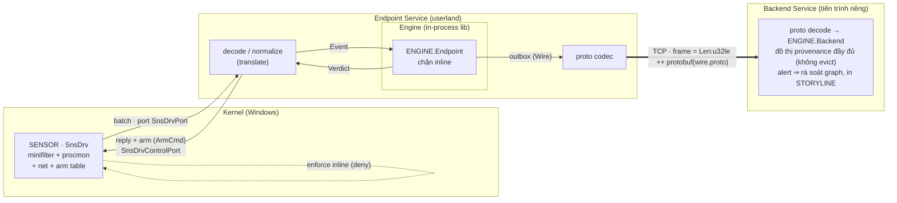

# Đặc tả Yêu cầu Phần mềm (SRS)
## EDR phòng-ngừa inline — Sensor · Endpoint Service · Backend Service · Engine

| | |
|---|---|
| **Sản phẩm** | Lõi EDR phòng-ngừa (inline behavioral prevention) hai phía endpoint–backend |
| **Phiên bản tài liệu** | 1.1 |
| **Ngày** | 2026-07-12 |
| **Trạng thái** | Prototype hoạt động (engine + endpoint/backend service + proto có test; sensor build/link sạch, chưa load-test runtime) |
| **Chuẩn tham chiếu** | IEEE Std 830-1998 (cấu trúc), MITRE ATT&CK (mô hình TTP), Protocol Buffers proto3 (contract wire) |

Tài liệu này đặc tả **cái hệ thống phải làm**, không phải cách hiện thực. Cách hiện thực nằm ở
[engine.md](engine.md) (thuật toán), [sensor/windows_driver/SnsDrv/EnforcementPlane.md](sensor/windows_driver/SnsDrv/EnforcementPlane.md)
(mặt phẳng thực thi) và mã nguồn. Mỗi yêu cầu có mã truy vết (FR/NFR/IR/DR) và một tiêu chí kiểm chứng phát biểu theo hành vi quan sát được.

---

## 1. Giới thiệu

### 1.1 Mục đích
Đặc tả yêu cầu cho một hệ EDR **phát hiện và ngăn chặn hành vi tấn công tại chỗ (inline)** trên
endpoint, kiến trúc tách làm hai phía: một **endpoint** nhanh/nhẹ/chính xác chặn trong cửa sổ thời
gian ngắn, và một **backend** giữ đồ thị forensic đầy đủ để tương quan không giới hạn và vũ trang
ngược. Hai phía được triển khai thành **hai tiến trình tách biệt** trao đổi qua một **contract wire**
(Protocol Buffers). Người đọc mục tiêu: kỹ sư phát triển, kiểm thử, đánh giá bảo mật, và người tích hợp.

### 1.2 Phạm vi
Hệ thống gồm **bốn thành phần** (kèm một thành phần contract), mỗi thành phần một vai trò tách bạch:

1. **Sensor** — driver kernel-mode Windows (minifilter `SnsDrv`) thu thập telemetry (process,
   file, network, remote-thread), đóng batch và đẩy lên userland; giữ **bảng arm** để thực thi
   đồng bộ inline.
2. **Endpoint Service** — tiến trình userland (Rust) làm cầu nối: giải mã batch của sensor, chuẩn
   hoá thành event của engine, chạy nửa `Endpoint` của engine để **chặn inline**, **trả quyết định
   chặn** cùng lệnh arm về sensor, và **ship mọi event + alert lên backend service** qua contract
   wire.
3. **Backend Service** — tiến trình userland (Rust) giữ **đồ thị provenance đầy đủ** (nửa `Backend`
   của engine, không evict): lắng nghe TCP, nhận stream wire từ endpoint service, dựng đồ thị, và
   khi nhận alert (BlockReport) thì **rà soát đồ thị, dựng lại và hiển thị toàn bộ chuỗi**.
4. **Engine** — lõi phát hiện (Rust, zero phụ thuộc ngoài) dùng như **thư viện** cho cả hai service:
   nửa `Endpoint` (chặn inline) + nửa `Backend` (forensic).

Ngoài ra có một thành phần **Proto** định nghĩa **contract wire** giữa endpoint service và backend
service dưới dạng một schema **Protocol Buffers proto3**, với code trao đổi sinh tự động từ schema;
đây là nơi **duy nhất** chạm phụ thuộc ngoài, cô lập khỏi lõi phát hiện.

**Trong phạm vi:** thu thập telemetry, chuẩn hoá event, gán nhãn TTP, tương quan theo mẫu chuỗi
tấn công, chấm điểm, ra quyết định ALLOW/DENY inline, dựng lại chuỗi forensic khi chặn, cơ chế
arm/disarm hai chiều, và ship telemetry/alert endpoint→backend qua contract wire trên TCP.

**Ngoài phạm vi (giai đoạn này):** cảm biến Linux (bpf_lsm), console quản trị đa-host, tương quan
xuyên nhiều endpoint trên backend (backend hiện xử lý **tuần tự từng kết nối**, chưa namespace theo
endpoint), reconnect/buffer khi backend offline, persist đồ thị xuống đĩa, kênh arm ngược **có chữ
ký** (chỉ thị arm kèm chữ ký/seq/TTL), cập nhật rule từ xa. Xem
[§8 Ràng buộc & giới hạn](#8-ràng-buộc-giả-định-và-giới-hạn-assumptions--limitations).

### 1.3 Định nghĩa và thuật ngữ
| Thuật ngữ | Nghĩa |
|---|---|
| **TTP** | Tactic/Technique/Procedure (MITRE ATT&CK); ví dụ T1486 (mã hoá dữ liệu), T1003 (dump LSASS) |
| **Tagger** | Luật gán một event thô sang một TTP khi mọi điều kiện của luật đó đúng |
| **Pattern** | Mẫu chuỗi tấn công dưới dạng **DAG thứ tự bộ phận** (partial-order precedence DAG) |
| **Automaton** | Trạng thái tiến độ khớp một pattern trên một storyline (bitmask + binding) |
| **Storyline** | Tập thực thể được nối bằng quan hệ nhân-quả; đơn vị tương quan của endpoint |
| **Identity** | Định danh ổn định: process = `(pid, start_ts)`, file = FileId `(dev,inode)`/`(vol,FileId)`, socket = `(proto,ip,port)` — **không phải path** |
| **Binding** | Ràng buộc một *vai* (role) phải phân giải về **cùng identity** qua các bước ("ghi X rồi chạy đúng X") |
| **Working set** | Tập thực thể endpoint đang giữ nóng, giới hạn bởi **bất biến bộ nhớ** (giữ khi còn bị ràng buộc hoặc còn trong cửa sổ thời gian) |
| **seg_window** | Hạn chót theo mili-giây của một đoạn (segment) trong pattern |
| **Chokepoint** | Bước *enforceable* mà tại đó có thể deny đồng bộ |
| **Arm** | Đẩy một `(identity, op)` xuống sensor để thực thi đồng bộ inline; **Disarm** gỡ bỏ |
| **θ_alert / θ_block** | Ngưỡng điểm để phát cảnh báo / để chặn |
| **Contract wire** | Giao thức trao đổi endpoint-service → backend-service, định nghĩa bằng một schema Protocol Buffers proto3; mỗi bản ghi là **telemetry event** hoặc **block report (alert)** |
| **Frame** | Đơn vị đóng gói một `Wire` trên TCP: `Len:u32le (chỉ payload) ++ payload` — protobuf không tự phân định ranh giới trên stream |
| **Alert** | Bản ghi `BlockReport` endpoint ship lên backend khi Deny, đề nghị backend truy vết và hiển thị chuỗi |

### 1.4 Tài liệu tham chiếu
- [engine.md](engine.md) — đặc tả thuật toán lõi (§0–§9).
- [sensor/windows_driver/SnsDrv/EnforcementPlane.md](sensor/windows_driver/SnsDrv/EnforcementPlane.md) — mặt phẳng thực thi kernel (§9).
- [proto/wire.proto](proto/wire.proto) — nguồn sự thật của contract wire; [proto/README.md](proto/README.md).
- [docs/todo.md](docs/todo.md) — roadmap tầng phát hiện chủ động trên backend (HOLMES/RapSheet/NoDoze…).
- README các crate: [engine/README.md](engine/README.md), [endpoint_service/README.md](endpoint_service/README.md),
  [backend_service/README.md](backend_service/README.md), [sensor/windows_driver/SnsDrv/readme.md](sensor/windows_driver/SnsDrv/readme.md).
- Nền tảng học thuật kèm repo: HOLMES (2019), POIROT (2019), RapSheet (Symantec 2020).

---

## 2. Mô tả tổng quan

### 2.1 Bối cảnh sản phẩm
Trên host thật, luồng event tích luỹ **vô hạn** theo thời gian. Quan sát nền tảng: thứ khiến trạng
thái phình vô hạn (đồ thị provenance) chỉ phục vụ **điều tra**; phát hiện inline **không cần** nó.
Vì vậy hệ thống phân vai theo đúng chủ sở hữu: cái nặng-để-điều-tra về backend; cái rẻ-để-chặn ở
lại endpoint. Đây là ràng buộc kiến trúc quyết định mọi yêu cầu bên dưới. Endpoint và backend chạy
thành **hai tiến trình riêng**: nửa `Backend` của engine không còn phải sống chung tiến trình với
`Endpoint`, mà thu telemetry từ nhiều endpoint qua contract wire.

Mặc định endpoint service chạy nửa `Backend` **in-process** (dựng chuỗi tại chỗ); khi truyền
`--backend <addr>` nó chuyển sang **ship outbox lên backend service** và chuỗi hiển thị trên console
của backend. Đây là cùng một nửa `Backend` của engine, chỉ khác nơi triển khai.

### 2.2 Chức năng chính (tóm tắt)
- Thu thập telemetry kernel và chuẩn hoá thành mô hình event thống nhất.
- Gán nhãn TTP từ event thô; tương quan nhiều TTP thành chuỗi tấn công theo thứ tự bộ phận.
- Chấm điểm kill-chain và ra quyết định ALLOW/DENY **tại chỗ, O(1)/event**.
- Dựng lại **toàn bộ chuỗi forensic** khi có block.
- Vũ trang ngược (arm) chỉ đúng `(identity, op)` một-bước-trước-chokepoint để thực thi đồng bộ mà
  không đánh thuế độ trễ lên mọi event.

### 2.3 Đặc điểm người dùng
| Vai | Nhu cầu |
|---|---|
| **Kỹ sư phát hiện (detection engineer)** | Thêm/sửa TTP và pattern **không cần biên dịch lại** engine |
| **Người vận hành SOC** | Đọc chuỗi forensic rõ ràng tại mỗi block trên console backend; ít false-positive |
| **Kỹ sư tích hợp** | Giao thức ổn định: telemetry sensor↔endpoint-service, contract wire endpoint↔backend-service; nạp engine như library |
| **Người đánh giá bảo mật** | Lõi hot-path **auditable**, build offline, engine không phụ thuộc ngoài (phụ thuộc cô lập ở crate proto) |

### 2.4 Môi trường vận hành
- **Sensor:** Windows x64, kernel-mode, WDK 10.0.26100, toolset `WindowsKernelModeDriver10.0`.
- **Endpoint Service:** ngôn ngữ Rust. Đường kết nối minifilter (`--port`) chỉ chạy trên Windows; phần giải mã/chuẩn-hoá/phát-hiện và uplink TCP (`--backend`) **cross-platform**.
- **Backend Service:** Rust (edition 2021), transport `std::net` TCP thuần → **cross-platform**;
  mặc định lắng nghe `127.0.0.1:7171`.
- **Engine:** thư viện Rust thuần, zero phụ thuộc ngoài, biên dịch mọi nền có Rust.
- **Proto:** thành phần contract; code trao đổi được **sinh tự động từ schema lúc build** bằng trình biên dịch protobuf đóng gói sẵn (không phải cài ngoài).

---

## 3. Yêu cầu chức năng (Functional Requirements)

### 3.1 Thu thập telemetry (Sensor)
| ID | Yêu cầu |
|---|---|
| **FR-S1** | Sensor PHẢI chặn (hook) và phát các loại event: tạo tiến trình, mở tiến trình (VM_READ), mở file, tạo remote-thread, và trạng thái tồn tại/kết thúc tiến trình. |
| **FR-S2** | Sensor PHẢI đóng nhiều event thành **batch** và gửi qua communication port `\SnsDrvPort` cho một client userland khi có kết nối. |
| **FR-S3** | Sensor PHẢI serialize theo định dạng ổn định để endpoint service giải mã byte-for-byte. |
| **FR-S4** | Với event mà `(pid, start_ms, op)` khớp **bảng arm**, sensor PHẢI gửi **đồng bộ kèm reply buffer**, chờ verdict, và **thực thi verdict inline** (chặn thao tác) rồi trả về; mọi event khác đi đường async fire-and-forget. |
| **FR-S5** | Sensor PHẢI hỗ trợ **static predicate**: một lớp event chokepoint một-bước (không thể arm trước, ví dụ đọc LSASS với VM_READ) được gửi đồng bộ theo mặc định. |
| **FR-S6** | Sensor PHẢI **miễn trừ enforcement cho chính pid của service** để tránh deadlock (service tự mở file trong khi xử lý một enforce đồng bộ). |

### 3.2 Cầu nối và chuẩn hoá (Endpoint Service)
| ID | Yêu cầu |
|---|---|
| **FR-V1** | Endpoint service PHẢI giải mã batch của sensor và **chuẩn hoá** mỗi sensor-event thành `Event` của engine theo ánh xạ: `ProcessCreate→exec`, `ProcessOpen(VM_READ)→read`, `FileOpen→open`, `RemoteThreadCreate→inject`, `ProcessExist/Exit→cập nhật bảng`. |
| **FR-V2** | Endpoint service PHẢI học và duy trì bảng `pid → {start_ts, image}` từ `ProcessCreate`/`ProcessExist` để (a) cấp identity `(pid, start_ts)` chống pid-reuse, và (b) suy ra *target image* của `ProcessOpen` nhằm nhận diện LSASS. |
| **FR-V3** | Endpoint service PHẢI nạp engine như thư viện và đưa từng event vào theo **một consumer có thứ tự**; timestamp phải **đơn điệu theo ms** (FILETIME/10000). |
| **FR-V4** | Trước khi cấp một event enforce đồng bộ cho engine, endpoint service PHẢI **xả hết telemetry đang chờ vào engine trước**, để ngữ cảnh storyline không bao giờ thiếu lúc tính verdict. |
| **FR-V5** | Endpoint service PHẢI tính quyết định theo batch (DENY nếu có ≥1 event bị chặn) và **trả về sensor** (1 byte qua `FilterReplyMessage` trên Windows). |
| **FR-V6** | Endpoint service PHẢI serialize các lệnh `ArmCmd` (Arm/Disarm/SetSelf) do engine phát và gửi xuống **control port** theo bản ghi 16 byte cố định. |
| **FR-V7** | Khi có tuỳ chọn `--backend <addr>`, endpoint service PHẢI **ship mọi bản ghi outbox** của nửa `Endpoint` (mỗi telemetry `WireEvent` và mỗi `BlockReport` khi chặn) lên backend service qua TCP, đóng khung theo contract wire ([IR-7](#55-contract-wire-endpoint-service--backend-service)); khi **không** có cờ này, endpoint service chạy nửa `Backend` **in-process** và dựng chuỗi tại chỗ (mặc định, tương thích ngược). |

### 3.3 Mô hình event và identity (Engine)
| ID | Yêu cầu |
|---|---|
| **FR-E1** | Engine PHẢI biểu diễn mỗi event chuẩn hoá gồm: `ts`, `op`, `actor` (luôn là process), `object`, và các thuộc tính. Tập `op`: exec, open, read, write, connect, inject, create, delete, load, dup. |
| **FR-E2** | Engine PHẢI khoá mọi so sánh thực thể qua **identity ổn định**, không qua path: process `(pid, start_ts)`, file = FileId token, socket `(proto,ip,port)`. |
| **FR-E3** | Identity file PHẢI **sống sót qua rename** (giữ nguyên token) và **phân biệt bản copy** (copy tạo token mới), đúng ngữ nghĩa FileId. |
| **FR-E4** | Chỉ các op **nhân-quả** (exec, inject, create, dup, write) mới **merge** storyline; các op "chạm" (read/open/connect) để lại cạnh cho forensic nhưng **không** hợp nhất. |

### 3.4 Gán nhãn TTP (Tagger)
| ID | Yêu cầu |
|---|---|
| **FR-T1** | Engine PHẢI phát một TTP cho một event khi **mọi điều kiện** của một tagger đúng. Tập điều kiện là **đóng** (closed set, không phải ngôn ngữ biểu thức): `op ∈ {…}`, `image_base_in`, `target_image_base`, `attr_true`, `entropy_gt`, `write_rate_ge`, `dir_spread_ge`, `cmd_recovery_inhibit`. |
| **FR-T2** | Engine PHẢI duy trì bộ đếm trượt theo actor cho tốc độ ghi và độ trải thư mục (`write_rate`, `dir_spread`) cập nhật O(1) trong cửa sổ. |
| **FR-T3** | Bộ TTP/tagger tối thiểu PHẢI gồm: T1059 (interpreter), T1083 (file discovery), T1490 (inhibit recovery), T1486 (encrypt impact), T1003 (LSASS dump). |

### 3.5 Tương quan theo pattern (partial-order DAG)
| ID | Yêu cầu |
|---|---|
| **FR-P1** | Pattern PHẢI biểu diễn dưới dạng **DAG thứ tự bộ phận**: mỗi bước có `bit`, `prereq_mask` (thứ tự), `seg_window` (hạn chót), có thể `enforceable`/`optional`/`block`, và các **binding vai**. Tiến độ là **bitmask** — nhóm tự-do-thứ-tự, mốc, và ô-OR đều rút ra từ cùng một phép kiểm bit O(1). |
| **FR-P2** | Một bước chỉ được **commit** khi thoả tất cả: chưa hoàn thành; `prereq` đã xong; trong `seg_window` tính từ lúc prereq được thoả; hợp `scope`; và **BINDING_OK** — mọi vai phân giải về đúng identity đã bind ("ghi X, chạy Y" bị từ chối tại đây). |
| **FR-P3** | Engine PHẢI hỗ trợ ba `scope`: `same_storyline`, `same_actor`, `free`. |
| **FR-P4** | Root-seeding PHẢI qua một **cổng đóng** (`RootGate`): `always` hoặc `pe_write` (chỉ event ghi file thực thi mới seed pattern dropper) để giữ số automaton sống **bounded**. |
| **FR-P5** | Bộ pattern tối thiểu PHẢI gồm: `dropper_write_then_exec` (ghi X → chạy đúng X, chokepoint tại exec), `ransomware_fast_encrypt` (T1059 → {T1490, T1083} → T1486, chokepoint tại T1486), và `lsass_credential_dump` (chặn tại read). |
| **FR-P6** | Pattern/tagger/TTP PHẢI **nạp từ file rule lúc chạy**; thêm hoặc sửa một mẫu **KHÔNG được** đòi biên dịch lại engine (ràng buộc thiết kế cốt lõi). |

### 3.6 Chấm điểm và quyết định
| ID | Yêu cầu |
|---|---|
| **FR-D1** | Engine PHẢI tính điểm kill-chain từ: số **tactic** phủ, tổng **severity**, **thứ tự quan sát** (order), và tổng **rarity**, theo trọng số cố định. |
| **FR-D2** | Khi automaton **accepting** và điểm ≥ `θ_block` **tại** bước chokepoint enforceable → verdict **Block** → quyết định **Deny**. Điểm ≥ `θ_alert` → **Alert**; thấp hơn → **Suspect/None**. |
| **FR-D3** | Khi chưa accepting nhưng điểm ≥ `θ_block` và còn một bước enforceable đang chờ, engine PHẢI **arm** identity của actor cho op của chokepoint đó (dự đoán một-bước-trước). |
| **FR-D4** | Khi Deny, engine PHẢI ship một **BlockReport** để backend truy vết và dựng chuỗi. |
| **FR-D5** | Một dropper "ghi rồi chạy đúng cùng file" **tự thân chỉ đạt Suspect** (installer/updater làm y hệt) — không được chạm ngưỡng chặn chỉ vì hành vi này. |
| **FR-D6** | "Ghi X, chạy Y" (khác identity) **KHÔNG được** false-positive. |

### 3.7 Bất biến working-set và vòng đời (Endpoint)
| ID | Yêu cầu |
|---|---|
| **FR-W1** | Endpoint **KHÔNG được** dựng đồ thị cục bộ; PHẢI **ship-and-forget** mọi event lên backend rồi quên cạnh. |
| **FR-W2** | Endpoint PHẢI giữ một `Entity` **khi và chỉ khi** `refcount > 0` (đang bị ≥1 automaton bind) **HOẶC** `last_touch ≥ now − W`. Thực thể nguội-và-không-bind PHẢI bị sweep. |
| **FR-W3** | Binding PHẢI theo **identity** (lưu `NodeKey`, không phải con trỏ node) để việc bỏ một node khỏi ACTIVE **không bao giờ làm gãy** automaton. |
| **FR-W4** | Automaton PHẢI bị **GC** khi không tiến triển quá `seg_window` lớn nhất của pattern; GC PHẢI **nhả refcount** các identity nó đã ghim. |
| **FR-W5** | Số node/automaton mỗi storyline PHẢI có **trần**; merge vượt trần thì **không merge ở endpoint** — để backend khâu lại từ cạnh nhân-quả đã ship (hub-cap). |

### 3.8 Backend forensic (nửa Backend của Engine)
| ID | Yêu cầu |
|---|---|
| **FR-B1** | Backend PHẢI nhận **mọi** event endpoint ship. |
| **FR-B2** | Khi nhận BlockReport, backend PHẢI **dựng lại toàn bộ chuỗi** (`Chain`) và đánh dấu bước bị chặn `*** BLOCKED ***`. |
| **FR-B3** | Backend PHẢI giữ **đồ thị provenance đầy đủ, không evict**; nút/cạnh không bao giờ bị xoá để phục vụ truy vết và (roadmap) phát hiện chủ động ngoài rule endpoint. |

### 3.9 Dịch vụ backend (transport & console)
| ID | Yêu cầu |
|---|---|
| **FR-BS1** | Backend service PHẢI **lắng nghe TCP** (mặc định `127.0.0.1:7171`, đổi qua `--listen`) và nhận stream wire từ endpoint service; PHẢI hỗ trợ thêm nguồn `--file` (replay) và `--stdin`. |
| **FR-BS2** | Backend service PHẢI **ráp lại frame** từ byte-stream (một `Wire` có thể đến làm nhiều mảnh TCP, hoặc nhiều `Wire` trong một mảnh) và giải mã theo contract wire ([IR-7](#55-contract-wire-endpoint-service--backend-service)), bỏ qua byte lửng chưa đủ frame. |
| **FR-BS3** | Đồ thị provenance PHẢI **sống qua nhiều kết nối**: endpoint ngắt rồi kết nối lại vẫn ghép tiếp vào lịch sử cũ (đồ thị thuộc về service, không thuộc về kết nối). |
| **FR-BS4** | Với mỗi `WireEvent`, backend service PHẢI in một dòng ingest; với mỗi `BlockReport` (alert), PHẢI in tiêu đề alert rồi **hiển thị toàn bộ STORYLINE** đã dựng lại (FR-B2). |
| **FR-BS5** | Alert có `actor` **chưa từng** xuất hiện trong đồ thị PHẢI được báo cáo an toàn (không crash), kèm ghi chú không truy vết được. |

### 3.10 Mặt phẳng arm hai chiều
| ID | Yêu cầu |
|---|---|
| **FR-A1** | Engine PHẢI phát luồng `ArmCmd::Arm{actor,op}` / `Disarm{actor}` sao cho **chỉ** các identity một-bước-trước-chokepoint được arm; khi block phát hoả hoặc storyline bị GC, PHẢI **Disarm**. |
| **FR-A2** | Arm PHẢI keyed theo identity `(pid, start_ts)`; pid tái sử dụng **KHÔNG được** kế thừa arm cũ (`reconcile_arms` loại arm không còn được storyline sống bảo chứng). |
| **FR-A3** | Endpoint service PHẢI đăng ký **pid của chính nó** (SetSelf) để sensor miễn trừ (khớp FR-S6). |
---

## 4. Yêu cầu phi chức năng (Non-Functional Requirements)

### 4.1 Hiệu năng
- **NFR-P1** — Đường verdict của endpoint PHẢI là **O(1)/event** và **không chờ mạng**.
- **NFR-P2** — Độ trễ enforcement chỉ được rơi vào tập `(identity, op)` đã arm hoặc thuộc static
  predicate; phần còn lại là telemetry async. Khối lượng gửi-đồng-bộ phải **rất nhỏ**.
- **NFR-P3** — Sensor PHẢI tối thiểu hoá overhead tra cứu trên đường I/O nóng để tối đa throughput.

### 4.2 Bộ nhớ
- **NFR-M1** — Bộ nhớ endpoint PHẢI bị chặn bởi **bất biến working-set** (§3), **không** bởi một
  chính sách evict. Cận: `|ACTIVE| ≤ Σ(arity bind của automaton sống) + |{thực thể chạm trong W}|`.
- **NFR-M2** — Tiến độ automaton **không bao giờ mất vì áp lực bộ nhớ** (thực thể bị bind là bất-khả-bỏ);
  automaton chỉ chết theo `seg_window` của chính nó — **không có "LRU giết chuỗi lén lút"**.

### 4.3 Độ chính xác
- **NFR-A1** — Hệ thống PHẢI chặn được chuỗi mà **bằng chứng đến trong khi automaton còn sống** và
  các thực thể bị bind còn ấm — đây là *khế ước phát hiện* của endpoint.
- **NFR-A2** — Ngưỡng và trọng số phải khiến hành vi lành tính phổ biến (installer, updater) **không**
  chạm ngưỡng chặn (xem FR-D5/FR-D6).

### 4.4 Bảo trì & khả kiểm
- **NFR-M3** — Lõi phát hiện (hot-path) PHẢI **auditable** và **build offline**: **không phụ thuộc thư viện ngoài**. Mọi phụ thuộc ngoài PHẢI **cô lập trong thành phần contract**; lõi phát hiện và hai service chỉ dùng nó qua một giao diện ổn định, không chạm phụ thuộc trực tiếp.
- **NFR-M4** — Vốn từ điều kiện của tagger là **tập đóng** (closed set); chỉ khi cần một *hình dạng điều kiện thực sự mới* mới phải mở rộng phần lõi — đúng thiết kế: tagger là lớp phụ thuộc nền tảng.
- **NFR-M5** — Contract wire PHẢI có **một nguồn sự thật duy nhất** là schema; code trao đổi **sinh tự động từ schema lúc build**, không duy trì bản chép tay — sửa schema là tự đồng bộ hai phía. Tiến hoá PHẢI **tương thích ngược**: chỉ thêm trường mới, không đổi nghĩa/kiểu trường cũ; bên nhận PHẢI **bỏ qua trường lạ**.

### 4.5 Tính khả chuyển & tin cậy
- **NFR-C1** — Lõi decode/normalize/engine, uplink TCP của endpoint service, và **toàn bộ backend
  service** PHẢI **cross-platform** và có test chạy trên mọi nền; chỉ transport minifilter (`--port`)
  mới giới hạn ở Windows.
- **NFR-R1** — Chính sách timeout khi enforce đồng bộ PHẢI xác định (fail-open hoặc fail-closed theo policy) khi verdict về quá hạn.
- **NFR-R2** *(mục tiêu, chưa hiện thực)* — Uplink endpoint→backend PHẢI **reconnect + buffer** khi
  backend tạm offline; hiện tại lỗi ghi socket chỉ log rồi bỏ, và endpoint từ chối khởi động nếu
  không kết nối được backend lúc đầu. Xem [§8](#82-giới-hạn-hiện-tại-đã-biết-có-chủ-đích).

### 4.6 Bảo mật của chính hệ thống
- **NFR-S1** — Đường reply/enforce KHÔNG được cho phép self-deadlock: pid service luôn được miễn
  trừ (FR-S6/FR-A3).
- **NFR-S2** *(mục tiêu, chưa hiện thực)* — Kênh arm ngược PHẢI **có chữ ký** với seq/TTL
  để sensor không thực thi lệnh giả mạo. Xem §8.

---

## 5. Yêu cầu giao diện ngoài (External Interface Requirements)

### 5.1 Giao thức telemetry Sensor → Endpoint Service (FltSendMessage)
- **IR-1** — Kết nối qua communication port `\SnsDrvPort` (`FilterConnectCommunicationPort`).
  **Batch** = `TotalSize:u32le` (gồm chính nó) ++ các event nối tiếp. **Event** = `Type:u8 ++
  TimeStamp:i64le` (100ns từ 1601) ++ phần riêng; chuỗi = `Length:u16le(byte) ++ UTF-16LE`. Bộ
  mã hoá/giải mã của endpoint service PHẢI khớp định dạng event của sensor **byte-for-byte**; bản
  ghi phải size-prefixed và căn chỉnh; loại record lạ PHẢI được bỏ qua an toàn.

### 5.2 Giao thức điều khiển Endpoint Service → Sensor (Arm/Disarm)
- **IR-2** — Kết nối qua control port thứ hai (ví dụ `\SnsDrvControlPort`). Bản ghi **16 byte cố
  định, căn chỉnh tự nhiên**: `Kind:u8 (1=Arm,2=Disarm,3=SetSelf) ++ Op:u8 ++ pad[2] ++ Pid:u32le
  ++ PidStartMs:u64le`. `PidStartMs` = FILETIME/10000 (khớp thành phần start-time của identity process). Op code
  ổn định: exec=1, read=2, write=3, inject=4, open=5, connect=6, create=7, delete=8, load=9,
  dup=10.
- **IR-3** — Driver xử lý: `Arm`→chèn `{Pid,PidStartMs,Op}`; `Disarm`→xoá mọi entry của
  `{Pid,PidStartMs}`; `SetSelf`→ghi nhận pid miễn trừ.

### 5.3 Giao diện phần mềm nội bộ
- **IR-4** — Cả hai service PHẢI tích hợp lõi phát hiện dưới dạng **thư viện nhúng** với một API ổn
  định: nạp từng event vào và nhận lại quyết định ALLOW/DENY kèm chuỗi forensic; không phụ thuộc
  chi tiết hiện thực bên trong lõi.
- **IR-5** — Rule PHẢI nạp từ **file ngoài** theo văn phạm một-directive-mỗi-dòng gồm bốn loại
  directive: `ttp`, `tagger`, `pattern`, `step`.

### 5.4 Giao diện người dùng (CLI, giai đoạn prototype)
- **IR-6** — `edr-endpoint-service` PHẢI hỗ trợ: `--demo` (LSASS dựng sẵn), `--file <bin>` (replay
  batch), `--stdin`, `--port <\SnsDrvPort>` (Windows), `--rules <file>`, và `--backend <addr>` (ship
  lên backend service, FR-V7). `edr-backend-service` PHẢI hỗ trợ: `--listen <addr>` (mặc định
  `127.0.0.1:7171`), `--file <bin>`, `--stdin`. `edr-replay` (engine) replay dataset `.evt` và in
  verdict + chuỗi backend + log + thống kê.

### 5.5 Contract wire Endpoint Service → Backend Service
- **IR-7** — Contract là một schema **Protocol Buffers proto3**. Một bản ghi **Wire** là *một trong
  hai*: **WireEvent** (telemetry — seq, gợi ý storyline của endpoint, danh sách TTP đã xác nhận, và
  event) hoặc **BlockReport** (alert khi chặn — seq, tên pattern, điểm, lý do, và event). **Event**
  gồm: thời điểm, loại thao tác (op), actor và object (mỗi cái là một identity: process / file /
  socket / khác), và bảng thuộc tính. Bên nhận PHẢI kiểm tra hợp lệ: nhánh lựa-chọn phải được đặt
  và op phải là giá trị xác định.
- **IR-8** — **Framing trên TCP** (nằm ngoài schema, vì message protobuf không tự phân định ranh
  giới trên stream): mỗi `Wire` đóng khung `Len:u32le (chỉ payload) ++ payload`; bên nhận chờ đủ
  byte mới giải mã một frame. Bytes payload PHẢI **decode được bằng bất kỳ công cụ protobuf chuẩn nào**.

---

## 6. Ràng buộc thiết kế (Design Constraints)
- **DR-1** — Engine **zero phụ thuộc ngoài** (bắt buộc để auditable + build offline). Mọi phụ thuộc
  ngoài của workspace **cô lập trong crate proto**; engine không phụ thuộc proto.
- **DR-2** — Endpoint **không lưu cạnh, không lịch sử**; chỉ giữ trạng thái *phát hiện*. Đồ thị đầy
  đủ chỉ nằm ở backend.
- **DR-3** — Mọi so sánh thực thể qua **identity**, tuyệt đối không qua path string.
- **DR-4** — Vốn điều kiện tagger là **closed set**; không nhúng ngôn ngữ biểu thức tuỳ ý.
- **DR-5** — Root-seeding qua **cổng đóng** data-selectable (`RootGate`), không phải mã tuỳ ý.
- **DR-6** — Sensor: mô hình singleton tĩnh; toolset WDK `WindowsKernelModeDriver10.0` (10.0.26100).
- **DR-7** — Contract endpoint↔backend là **proto3 với một nguồn sự thật duy nhất** (schema); code
  trao đổi **sinh tự động** từ schema, tiến hoá **tương thích ngược**. Mô hình dữ liệu thuộc **lõi
  phát hiện**; thành phần contract chỉ sở hữu phần mã hoá/giải mã.

---

## 7. Yêu cầu kiểm thử & tiêu chí chấp nhận (Verification)
Mỗi tiêu chí dưới đây là **tiêu chí chấp nhận** phát biểu theo **hành vi quan sát được**; mỗi tiêu chí được bảo chứng bằng một ca kiểm thử tự động.

| ID | Tiêu chí chấp nhận (hành vi quan sát được) |
|---|---|
| AC-1 | Ransomware chặn tại **write mã hoá đầu tiên** |
| AC-2 | Nhóm giữa đảo thứ tự vẫn chặn (FR-P1) |
| AC-3 | Dropper cùng-file chỉ Suspect (FR-D5) |
| AC-4 | "Ghi X chạy Y" không false-positive (FR-D6) |
| AC-5 | LSASS dump chặn tại read + dựng chuỗi (FR-P5/FR-B2) |
| AC-6 | Backend nhận mọi event (FR-B1) |
| AC-7 | Working-set sweep thực thể nguội-không-bind (FR-W2) |
| AC-8 | Arm chokepoint rồi Disarm khi block (FR-A1) |
| AC-9 | Batch encode/decode round-trip (IR-1) |
| AC-10 | Record size-prefixed & aligned, bỏ record lạ (IR-1) |
| AC-11 | Cờ reply-expected round-trip (FR-S4) |
| AC-12 | LSASS dump end-to-end qua endpoint service (FR-V1..V5) |
| AC-13 | Exist/Exit chỉ cập nhật trạng thái (FR-V2) |
| AC-14 | Process-open lành tính không bị chặn (NFR-A2) |
| AC-15 | Batch phơi identity đã arm cho driver (FR-A1) |
| AC-16 | Timestamp đơn điệu theo ms (FR-V3) |
| AC-17 | Bytes wire khớp chuẩn protobuf từng byte (IR-7/IR-8) |
| AC-18 | Wire roundtrip mọi message/NodeKey + defaults (IR-7) |
| AC-19 | Frame ráp đúng khi cắt vụn / nhiều frame (IR-8) |
| AC-20 | Bỏ qua field lạ / từ chối payload sai (NFR-M5) |
| AC-21 | Stream wire dựng lại chuỗi ở backend service (FR-BS2/BS4) |
| AC-22 | Alert không có lịch sử vẫn báo cáo an toàn (FR-BS5) |

---

## 8. Ràng buộc, giả định và giới hạn (Assumptions & Limitations)

### 8.1 Giả định
- Sensor cung cấp đủ thuộc tính để tagger hoạt động (ví dụ `entropy`, `pe`, `vm_read`). *Hiện tại
  sensor chưa phát **file-write + entropy*** → pattern ransomware (T1486) chưa dựng được từ sensor
  thật; ca end-to-end demo là **LSASS credential dump (T1003)**.
- Trên Windows, một pid chỉ va chạm identity nếu được tái tạo **trong cùng một mili-giây** — coi
  như bỏ qua được.

### 8.2 Giới hạn hiện tại (đã biết, có chủ đích)
- **G-1** — Driver hiện gửi telemetry kiểu **notify-only** và pre-op không giữ thao tác lại →
  **chưa chặn đồng bộ thật**. Đường trả verdict đã sẵn ở endpoint service; cần driver gửi kèm reply
  buffer / nhận bảng arm để bật.
- **G-2** — Phần enforcement phía driver (bảng arm, gửi-kèm-reply, thực thi đồng bộ, control
  callback) **biên dịch/link sạch** nhưng **chưa load-test runtime** (mức IRQL đường đồng bộ, kiểm
  tra vùng đệm control, thứ tự khoá theo vòng đời kết nối cần kiểm trên máy Windows thật).
- **G-3** — **Chưa hiện thực:** kênh arm ngược **có chữ ký** (chỉ thị arm kèm chữ ký/seq/TTL),
  stitch tương quan xuyên host, cảm biến Linux (bpf_lsm), cập nhật rule từ xa.
- **G-4** — Token file ở nhánh service hiện dùng **path** làm khoá (sensor chưa cấp FileId thật);
  đây là *stand-in*, chưa đạt bất biến FR-E3 cho tới khi sensor cấp `(vol, FileId)`.
- **G-5** — Backend service hiện xử lý **tuần tự từng kết nối** và **chưa namespace node theo
  endpoint**: nhiều endpoint đồng thời hoặc trùng `(pid, start_ts)` giữa các host sẽ lẫn đồ thị.
  Multi-endpoint (một `endpoint_id`/kết nối, accept đa luồng) là hạng mục roadmap.
- **G-6** — Uplink endpoint→backend **chưa reconnect/buffer** (NFR-R2): backend offline lúc khởi
  động thì endpoint từ chối chạy; rớt giữa chừng thì lỗi ghi socket chỉ được log rồi bỏ.
- **G-7** — Backend service **chưa persist đồ thị** xuống đĩa: restart là mất lịch sử (chưa retro-hunt
  sau khởi động lại). Append-log + snapshot là hạng mục roadmap ([docs/todo.md](docs/todo.md)).
- **G-8** — Backend hiện **chỉ truy vết thụ động** khi có alert; **chưa** tự phát hiện bất thường
  ngoài rule endpoint (kill-chain correlation/anomaly detection) — là nội dung roadmap giai đoạn 1–3
  trong [docs/todo.md](docs/todo.md).

### 8.3 Ghi chú đánh giá — kháng evasion bằng copy file
Vì FR-E3 (copy tạo token mới) **và** FR-P4 (`root_gate=pe_write` seed lại ở **mọi** lần ghi PE),
kịch bản "ghi X → copy X→Y → chạy Y" **vẫn bị chặn** khi Y được ghi dưới dạng PE và write/exec cùng
một storyline: bản copy tự re-seed automaton dropper và bind theo chính token của nó. Hai khe hở
còn lại cần cân nhắc bổ sung rule: (a) ghi non-PE rồi mới làm cho chạy được (cờ `pe` chỉ xét lúc
write), và (b) tách write và exec sang hai lineage/storyline khác nhau (do exec chỉ `touch` file
image, không `link` vào storyline). Không thuộc phạm vi bắt buộc của phiên bản này nhưng ghi nhận
là hạng mục theo dõi.
