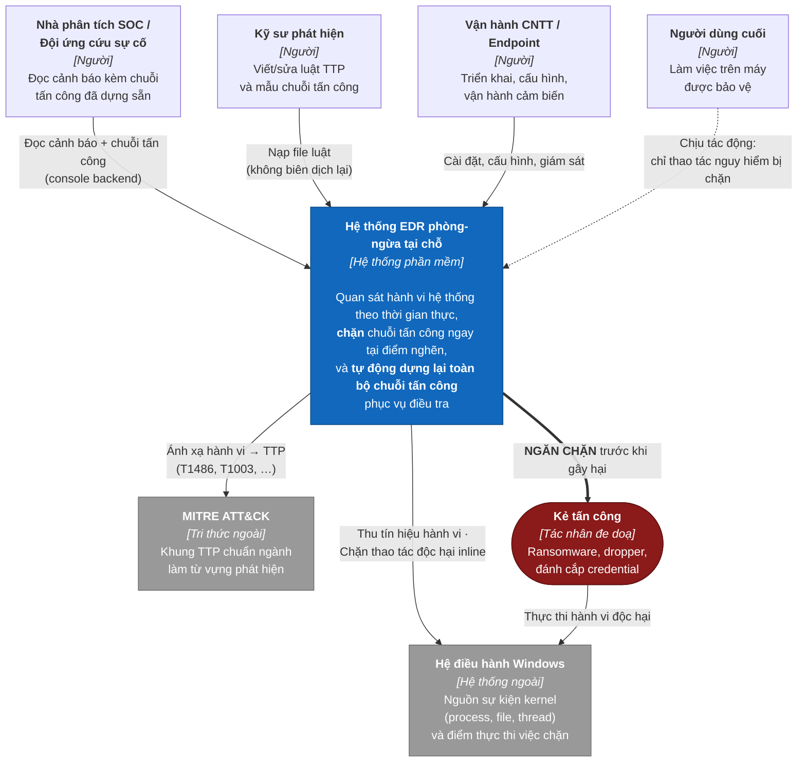
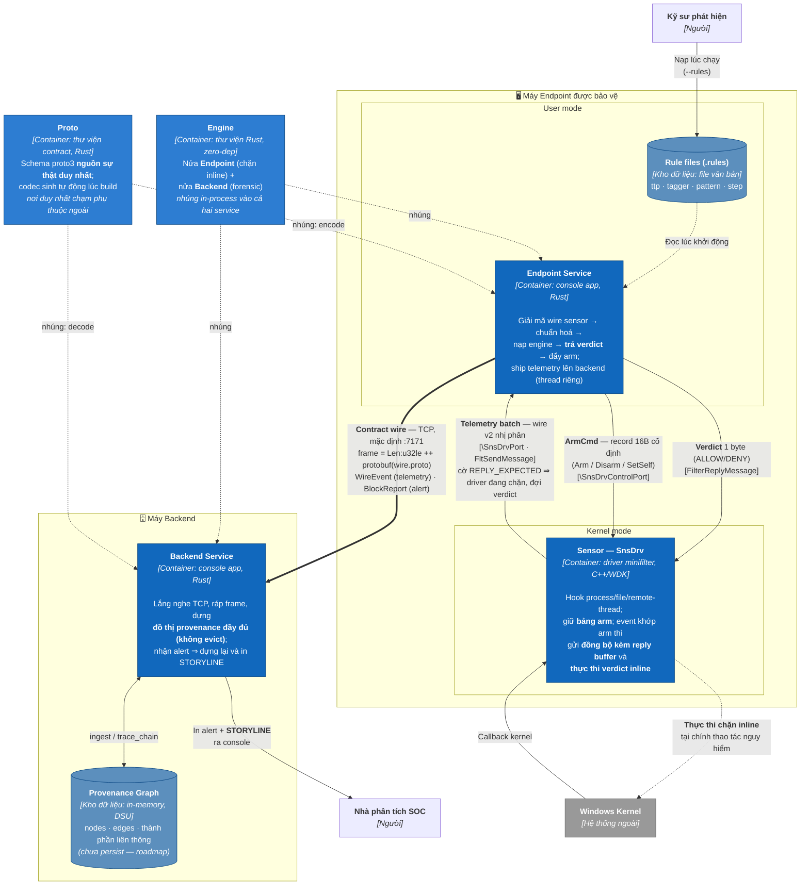
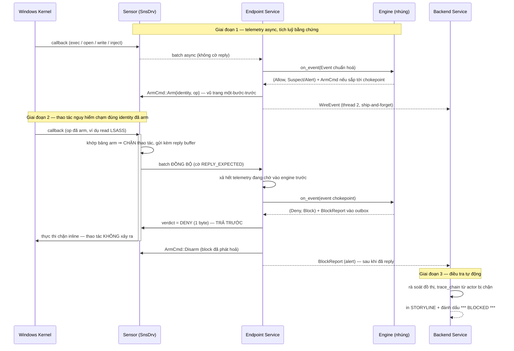

# Thiết kế Tổng thể (TKTT)
## EDR phòng-ngừa hành vi tại chỗ — kiến trúc hai phía endpoint–backend

| | |
|---|---|
| **Sản phẩm** | Lõi EDR phòng-ngừa hành vi tấn công tại chỗ (inline behavioral prevention) |
| **Phiên bản tài liệu** | 1.0 |
| **Ngày** | 2026-07-16 |
| **Trạng thái** | Prototype hoạt động (engine + hai service + proto có test; sensor build/link sạch, chưa load-test runtime) |
| **Mô hình mô tả** | C4 model — **C1 System Context** và **C2 Container** |
| **Đối tượng đọc** | Kiến trúc sư, kỹ sư phát triển, người đánh giá bảo mật, người tích hợp |
| **Tài liệu liên quan** | [BRD.md](BRD.md) (nghiệp vụ) · [SRS.md](SRS.md) (yêu cầu) · [SDD_engine.md](SDD_engine.md), [SDD_endpoint.md](SDD_endpoint.md) (thiết kế chi tiết) · [todo.md](todo.md) (lộ trình) |

Tài liệu này mô tả **thiết kế tổng thể** ở hai mức trên cùng của mô hình C4: **C1 — System Context**
(hệ thống nằm ở đâu, phục vụ ai, nói chuyện với gì) và **C2 — Container** (hệ thống gồm những đơn vị
triển khai/chạy nào, mỗi cái chịu trách nhiệm gì, giao tiếp với nhau ra sao). Mức C3 (Component) và
C4 (Code) **không** thuộc phạm vi tài liệu này — chúng nằm ở [SDD_engine.md](SDD_engine.md) và
[SDD_endpoint.md](SDD_endpoint.md).

---

## 1. Bối cảnh và động lực kiến trúc

### 1.1 Vấn đề định hình kiến trúc
Trên một host thật, luồng sự kiện hệ thống (process, file, network) tích luỹ **vô hạn** theo thời
gian. Quan sát nền tảng — và là **ràng buộc quyết định toàn bộ kiến trúc**:

> Thứ khiến trạng thái phình vô hạn (đồ thị provenance) chỉ phục vụ **điều tra**;
> việc **chặn inline không cần** nó.

Hai mục tiêu vốn xung đột nhau: **chặn nhanh** (đòi trạng thái nhỏ, O(1)/event, không chờ mạng) và
**điều tra sâu** (đòi lịch sử đầy đủ, không evict). Gộp cả hai vào một nơi dẫn tới hoặc endpoint nặng
nề, hoặc quyết định chặn chậm. Vì vậy hệ thống **phân vai theo đúng chủ sở hữu**: cái *nặng-để-điều-tra*
đẩy về backend; cái *rẻ-để-chặn* ở lại endpoint.

### 1.2 Các quyết định kiến trúc cốt lõi

| ID | Quyết định | Lý do | Truy vết |
|---|---|---|---|
| **QĐ-1** | **Tách hai phía endpoint/backend**, chạy thành hai tiến trình riêng | Dung hoà chặn-nhanh ↔ điều-tra-sâu (§1.1) | BR-1, BR-5, DR-2 |
| **QĐ-2** | Endpoint **không dựng đồ thị**: ship-and-forget mọi event rồi quên cạnh | Chặn bộ nhớ endpoint bằng *bất biến working-set*, không bằng chính sách evict | FR-W1, NFR-M1 |
| **QĐ-3** | Backend giữ **đồ thị provenance đầy đủ, không evict** | Dựng lại toàn bộ chuỗi tấn công khi có chặn; nền cho phát hiện chủ động (roadmap) | FR-B3, BR-5 |
| **QĐ-4** | Lõi phát hiện là **thư viện zero phụ thuộc ngoài**, dùng chung cho cả hai service | Auditable + build offline — điều kiện niềm tin cho sản phẩm an ninh | NFR-M3, DR-1, BR-8 |
| **QĐ-5** | Mọi phụ thuộc ngoài **cô lập trong thành phần contract** (proto) | Giữ hot-path sạch; một nguồn sự thật cho wire | NFR-M5, DR-7 |
| **QĐ-6** | Chỉ **arm** `(identity, op)` một-bước-trước-chokepoint mới đi đường đồng bộ | Độ trễ chỉ rơi vào đúng thao tác nguy hiểm, không đánh thuế mọi event | NFR-P2, BR-3 |
| **QĐ-7** | Mọi so sánh thực thể qua **identity ổn định**, tuyệt đối không qua path | Chống pid-reuse và giả mạo path — vừa chống bỏ sót vừa chống chặn nhầm | DR-3, BR-10 |
| **QĐ-8** | Nội dung phát hiện (TTP/tagger/pattern) **nạp từ file rule lúc chạy** | Thêm/sửa mẫu không cần biên dịch lại hay tái triển khai agent | FR-P6, BR-6 |
| **QĐ-9** | Uplink lên backend chạy **thread riêng, best-effort (đầy ⇒ drop)** | Backend chậm/mất **không bao giờ** chặn đường verdict | NFR-P1, NFR-R2 |

---

## 2. C1 — System Context (Mức 1: Bối cảnh hệ thống)

Mức C1 trả lời: **hệ thống là gì, ai dùng, và nó phụ thuộc vào cái gì bên ngoài.** Ở mức này toàn bộ
giải pháp là **một hộp đen duy nhất**.

### 2.1 Sơ đồ bối cảnh

### 2.2 Người dùng và mối quan tâm

| Vai | Tương tác với hệ thống | Mối quan tâm chính | Truy vết |
|---|---|---|---|
| **Nhà phân tích SOC / Ứng cứu sự cố** | Đọc cảnh báo và **STORYLINE** đã dựng sẵn trên console backend | Cảnh báo có ngữ cảnh đầy đủ, ít dương-tính-giả, không phải ghép nối thủ công | BR-5, FR-BS4 |
| **Kỹ sư phát hiện** | Soạn/nạp file `.rules` (`ttp`, `tagger`, `pattern`, `step`) | Thêm mẫu tấn công mới **không** cần biên dịch lại engine hay tái triển khai agent | BR-6, FR-P6, IR-5 |
| **Vận hành CNTT / Endpoint** | Cài driver, chạy hai service, đặt tham số CLI | Ổn định, chi phí hiệu năng thấp, không tự gây gián đoạn | BR-3, BR-11 |
| **Người dùng cuối** | Không tương tác trực tiếp | Máy không chậm; chỉ đúng thao tác nguy hiểm mới trả giá độ trễ | BR-3, NFR-P2 |
| **Người đánh giá bảo mật** | Rà soát lõi hot-path, dựng lại offline | Lõi auditable, zero phụ thuộc ngoài | BR-8, NFR-M3 |

### 2.3 Phụ thuộc ngoài

| Hệ thống ngoài | Quan hệ | Ghi chú |
|---|---|---|
| **Hệ điều hành Windows (kernel)** | Vừa là **nguồn tín hiệu** (process/file/remote-thread), vừa là **điểm thực thi** việc chặn | Ràng buộc nền tảng của giai đoạn hiện tại; Linux (bpf_lsm) ngoài phạm vi |
| **MITRE ATT&CK** | **Từ vựng phát hiện**: mọi tagger phát ra một mã TTP; scoring dựa trên tactic phủ được | Tri thức, không phải phụ thuộc mã nguồn — nhúng vào file rule |
| **Kẻ tấn công** | Tác nhân đe doạ; hệ thống can thiệp vào chuỗi hành động của họ tại **điểm nghẽn** | Kịch bản trong phạm vi: ransomware, dropper, LSASS credential dump |

### 2.4 Ranh giới hệ thống

**Trong hộp đen:** thu thập telemetry, chuẩn hoá event, gán nhãn TTP, tương quan chuỗi, chấm điểm,
ra quyết định ALLOW/DENY inline, dựng lại chuỗi forensic, cơ chế arm/disarm hai chiều, và vận chuyển
telemetry endpoint → backend.

**Ngoài hộp đen (giai đoạn này):** console quản trị đa-host, tương quan xuyên nhiều endpoint, kênh
arm ngược **có chữ ký**, cập nhật rule từ xa, persist đồ thị qua khởi động lại, và tầng phát hiện
chủ động trên backend (xem [todo.md](todo.md)).

---

## 3. C2 — Container (Mức 2: Đơn vị triển khai)

Mức C2 mở hộp đen của §2 ra thành các **container** — đơn vị chạy/triển khai độc lập hoặc kho dữ
liệu. Mỗi container có một trách nhiệm tách bạch và một giao thức rõ ràng với hàng xóm.

### 3.1 Sơ đồ container

> **Ghi chú triển khai.** Mặc định (không có `--remote-addr` hoặc bật `--in-process`) endpoint service
> chạy **nửa Backend ngay trong tiến trình** và dựng chuỗi tại chỗ — tiện cho demo/thử nghiệm. Đây vẫn
> là *cùng một* nửa Backend của engine, chỉ khác nơi triển khai; sơ đồ trên vẽ cấu hình đầy đủ hai phía.

### 3.2 Bảng container

| Container | Công nghệ | Trách nhiệm | Không chịu trách nhiệm | Truy vết |
|---|---|---|---|---|
| **Sensor** (`SnsDrv`) | C++, WDK 10.0.26100, minifilter kernel-mode, Windows x64 | Hook process/file/remote-thread; đóng batch, đẩy lên userland; giữ **bảng arm**; gửi đồng bộ + **thực thi verdict inline**; miễn trừ pid của service | Không phát hiện, không chấm điểm — chỉ thu tín hiệu và thi hành | FR-S1…S6 |
| **Endpoint Service** | Rust, console app, userland | Giải mã wire v2 → chuẩn hoá → nạp engine → **trả verdict trước** → đẩy arm; ship telemetry/alert lên backend trên thread 2 | Không chứa logic phát hiện (ở Engine); không định nghĩa serialization backend (ở Proto) | FR-V1…V7, FR-A3 |
| **Backend Service** | Rust, `std::net` TCP thuần, cross-platform | Lắng nghe TCP; **ráp lại frame** từ byte-stream; dựng đồ thị; alert ⇒ dựng lại và in STORYLINE; hỗ trợ `--file`/`--stdin` để replay | Không ra quyết định chặn; hiện chưa tương quan xuyên host | FR-BS1…BS5 |
| **Engine** | Rust, **thư viện zero phụ thuộc ngoài** | Nửa `Endpoint`: working-set, storyline, matching bậc-riêng-phần, chấm điểm, verdict, arm. Nửa `Backend`: provenance graph + `trace_chain` | Không I/O mạng, không serialize — ranh giới hai nửa trong tiến trình chỉ là `Vec<Wire>` | FR-E*, FR-T*, FR-P*, FR-D*, FR-W*, FR-B* |
| **Proto** | Rust + schema proto3, codec sinh lúc build | Contract wire endpoint↔backend: **một nguồn sự thật** là schema; convert `pb ⇄ engine::wire`; đóng khung TCP | Không sở hữu mô hình dữ liệu (thuộc Engine) — chỉ sở hữu mã hoá/giải mã | IR-7, IR-8, DR-7 |
| **Rule files** *(kho dữ liệu)* | File văn bản, một directive/dòng | Nội dung phát hiện: `ttp`, `tagger`, `pattern`, `step` — tách hoàn toàn khỏi mã lõi | — | IR-5, FR-P6 |
| **Provenance Graph** *(kho dữ liệu)* | In-memory: `nodes` + `edges` + DSU | Lịch sử nhân-quả đầy đủ, **không evict**; sống qua nhiều kết nối | Chưa persist xuống đĩa — restart là mất lịch sử (G-7) | FR-B3, FR-BS3 |

### 3.3 Giao diện giữa các container

| # | Giữa | Giao thức / định dạng | Tính chất | Truy vết |
|---|---|---|---|---|
| **I1** | Sensor → Endpoint Service | Cổng minifilter `\SnsDrvPort`; **wire v2 nhị phân**: frame `TotalSize:u32 ++ Version:u16 ++ Count:u16` (bit `0x8000` = REPLY_EXPECTED) ++ các record (header 32B căn chỉnh tự nhiên) | **Đồng bộ** khi có cờ reply (driver đang chặn, đợi verdict); **async fire-and-forget** khi không | IR-1, FR-S2 |
| **I2** | Endpoint Service → Sensor (verdict) | `FilterReplyMessage`, **1 byte** (0 = allow, 1 = deny) kèm `MessageId` | Phải trả **trước** khi ship backend — verdict không được nằm sau một vòng TCP | FR-V5, §4.2 |
| **I3** | Endpoint Service → Sensor (control) | Cổng control; record **16 byte cố định**: `Kind:u8 (1=Arm,2=Disarm,3=SetSelf) ++ Op:u8 ++ pad[2] ++ Pid:u32le ++ PidStartMs:u64le` | Keyed theo **identity** `(pid, start_ms)` ⇒ pid tái dùng không kế thừa arm cũ | IR-2, IR-3, FR-A2 |
| **I4** | Endpoint Service → Backend Service | **TCP** (mặc định `127.0.0.1:7171`); frame = `Len:u32le (chỉ payload) ++ protobuf(wire.proto)`; payload là `WireEvent` **hoặc** `BlockReport` | **Ship-and-forget, best-effort**; hàng đợi đầy ⇒ drop (có đếm), không back-pressure; tự reconnect | IR-7, IR-8, FR-V7 |
| **I5** | Service ↔ Engine | **API thư viện nhúng**: `on_event(Event) -> (Decision, Verdict)`, `drain_outbox() -> Vec<Wire>`, `drain_arm_cmds()`, `ingest(Wire) -> Option<Chain>` | Đơn luồng, **gọi tuần tự** (state engine không thread-safe) | IR-4 |
| **I6** | Kỹ sư phát hiện → Engine | File `.rules` nạp lúc chạy qua `--rules`; bốn directive `ttp`/`tagger`/`pattern`/`step` | Thêm/sửa mẫu **thuần data**, không biên dịch lại | IR-5, FR-P6 |

---

## 4. Luồng chính xuyên container

### 4.1 Luồng chặn inline (đường nóng)

Ba tính chất mà luồng này bảo toàn:

- **Độ trễ chỉ rơi vào đúng thao tác nguy hiểm** (QĐ-6): chỉ event khớp bảng arm — hoặc thuộc static
  predicate như đọc LSASS với `VM_READ` — mới đi đường đồng bộ. Phần còn lại là telemetry async.
- **Ngữ cảnh không bao giờ thiếu lúc tính verdict** (FR-V4): trước khi cấp event đồng bộ cho engine,
  endpoint service **xả hết** telemetry đang chờ vào engine.
- **Verdict trả trước, ship sau** (§I2): driver đang chặn dưới timeout ngắn; một vòng TCP tới backend
  nằm trước verdict sẽ vượt timeout ⇒ fail-open ngoài ý muốn.

### 4.2 Luồng điều tra (đường nguội)
Mọi `WireEvent` đi lên backend service trên **thread 2**, hoàn toàn decoupled khỏi vòng lặp sự kiện.
Backend ráp frame từ byte-stream, dựng node/edge, và `union` thành phần liên thông khi gặp cạnh
nhân-quả. Khi nhận `BlockReport`, backend neo tại node actor, lấy toàn bộ component, sắp theo thời
gian và render — **chuỗi tấn công có sẵn ngay tại thời điểm chặn**, không cần ghép nối thủ công
(BR-5, KPI-4). Đồ thị **thuộc về service, không thuộc về kết nối**: endpoint ngắt rồi nối lại vẫn
ghép tiếp vào lịch sử cũ (FR-BS3).

---

## 5. Bất biến kiến trúc

Đây là những tính chất mà **mọi thay đổi thiết kế phải bảo toàn**:

| ID | Bất biến | Vì sao thiết yếu |
|---|---|---|
| **BB-1** | **Đường verdict là O(1)/event và không chờ mạng** | Là điều kiện để chặn kịp trong cửa sổ timeout của driver (NFR-P1) |
| **BB-2** | Endpoint giữ entity **khi và chỉ khi** `refcount > 0` (đang bị automaton bind) **hoặc** `last_touch ≥ now − W` | Bộ nhớ bị chặn bởi *bất biến*, không bởi chính sách evict; tiến độ automaton **không bao giờ mất vì áp lực bộ nhớ** — không có "LRU giết chuỗi lén lút" (NFR-M1, NFR-M2) |
| **BB-3** | Binding theo **identity** (`NodeKey`), không theo con trỏ node | Bỏ một node khỏi working set **không bao giờ** làm gãy automaton (FR-W3) |
| **BB-4** | Mọi so sánh thực thể qua identity: process `(pid, start_ts)`, file = FileId token, socket `(proto,ip,port)` — **không path** | Chống pid-reuse và giả mạo path; "ghi X, chạy Y" bị loại đúng tại gate BINDING_OK (DR-3, FR-D6) |
| **BB-5** | Chỉ op **nhân-quả** (`exec, inject, create, dup, write`) mới merge storyline; op "chạm" (`read/open/connect`) chỉ để lại cạnh | Ngăn hợp nhất bừa bãi làm nổ storyline, vẫn giữ đủ cạnh cho forensic (FR-E4) |
| **BB-6** | Vốn từ điều kiện tagger là **tập đóng**; root-seeding qua **cổng đóng** (`RootGate`) | Không nhúng ngôn ngữ biểu thức tuỳ ý vào hot path; số automaton sống **bounded** (DR-4, DR-5) |
| **BB-7** | Engine **zero phụ thuộc ngoài**; mọi phụ thuộc cô lập trong container Proto | Điều kiện để lõi auditable + build offline (DR-1, NFR-M3) |
| **BB-8** | Contract wire có **một nguồn sự thật** là schema; tiến hoá **tương thích ngược** (chỉ thêm field, bên nhận bỏ qua field lạ) | Sửa schema là tự đồng bộ hai phía, không có bản chép tay lệch nhau (NFR-M5, DR-7) |
| **BB-9** | pid của service luôn được sensor **miễn trừ** enforcement | Một sync-enforce tự kích sẽ deadlock chính đường verdict (NFR-S1, FR-S6) |
| **BB-10** | Enforcement **không mất** (reply inline); telemetry là **best-effort** (đầy ⇒ drop có đếm) | Phân tách rõ cái phải đúng tuyệt đối và cái được phép mất (QĐ-9) |

---

## 6. Ánh xạ thuộc tính chất lượng ↔ kiến trúc

| Thuộc tính | Cơ chế kiến trúc chịu trách nhiệm | Container liên quan |
|---|---|---|
| **Chặn kịp thời** | Verdict inline O(1), không I/O mạng; xả telemetry trước khi tính verdict; reply trước ship | Engine, Endpoint Service, Sensor |
| **Chi phí hiệu năng thấp** | Arm chỉ `(identity, op)` một-bước-trước-chokepoint; phần còn lại async; hot path gần zero-alloc (materialize một lần rồi *move*) | Sensor (bảng arm), Endpoint Service |
| **Bộ nhớ chặn cứng** | Bất biến working-set + sweep ba pha; GC automaton theo `seg_window`; hub-cap khi merge vượt trần | Engine (nửa Endpoint) |
| **Ít dương-tính-giả** | Binding theo identity; dropper cùng-file **tự thân chỉ đạt Suspect**; ngưỡng `theta_alert/theta_block` khai báo theo pattern | Engine, Rule files |
| **Điều tra nhanh** | Đồ thị đầy đủ không evict + `trace_chain` neo tại actor bị chặn | Backend Service, Provenance Graph |
| **Phản ứng nhanh với mối đe doạ mới** | Rule DSL nạp lúc chạy; thêm mẫu **thuần data** | Rule files, Engine |
| **Auditable / build offline** | Engine zero-dep, parser DSL viết tay; phụ thuộc ngoài cô lập ở Proto | Engine, Proto |
| **Khả chuyển** | Chỉ transport minifilter giới hạn Windows; decode/normalize/engine/uplink và **toàn bộ backend** cross-platform | Endpoint Service, Backend Service, Engine |
| **Không tự gây gián đoạn** | Chính sách timeout xác định (fail-open/fail-closed theo policy); tự miễn trừ pid service | Sensor, Endpoint Service |

---

## 7. Ràng buộc triển khai

| Container | Nền tảng | Ràng buộc |
|---|---|---|
| **Sensor** | Windows x64, kernel-mode | WDK 10.0.26100, toolset `WindowsKernelModeDriver10.0`; mô hình singleton tĩnh (DR-6) |
| **Endpoint Service** | Chạy cùng máy với Sensor | Đường minifilter (`--com-port`) **chỉ Windows**; decode/normalize/engine/uplink cross-platform. Phải đăng ký `SetSelf` lúc kết nối |
| **Backend Service** | Máy riêng hoặc cùng máy | `std::net` TCP thuần ⇒ cross-platform; mặc định `127.0.0.1:7171`; hiện xử lý **tuần tự từng kết nối** |
| **Engine** | — | Thư viện Rust thuần, biên dịch mọi nền có Rust; **đơn luồng, gọi tuần tự** |
| **Proto** | — | Codec sinh tự động lúc build bằng trình biên dịch protobuf đóng gói sẵn (không cần cài ngoài) |

---

## 8. Giới hạn kiến trúc hiện tại

Những điểm dưới đây là **giới hạn đã biết, có chủ đích** của giai đoạn prototype — chúng không phá vỡ
kiến trúc mà là phần chưa hoàn thiện của nó. Chi tiết ở [SRS §8.2](SRS.md#82-giới-hạn-hiện-tại-đã-biết-có-chủ-đích).

| ID | Giới hạn | Ảnh hưởng kiến trúc |
|---|---|---|
| **G-1/G-2** | Driver hiện gửi telemetry **notify-only**, pre-op chưa giữ thao tác lại ⇒ **chưa chặn đồng bộ thật**. Phần enforcement biên dịch/link sạch nhưng **chưa load-test runtime** | Đường verdict phía service đã sẵn sàng; cần bật phía driver và kiểm trên máy Windows thật |
| **G-4** | Token file hiện dùng **path** làm khoá (sensor chưa cấp FileId thật) | *Stand-in* — chưa đạt bất biến "rename giữ token, copy sinh token mới" (FR-E3) cho tới khi sensor cấp `(vol, FileId)` |
| **G-5** | Backend **chưa namespace node theo endpoint**, xử lý tuần tự từng kết nối | Nhiều endpoint đồng thời sẽ **lẫn đồ thị** nếu trùng `(pid, start_ts)`. Multi-endpoint là hạng mục roadmap |
| **G-6** | Uplink chưa buffer khi backend offline lúc khởi động | Telemetry sinh khi mất kết nối bị drop (bounded); enforcement **không** bị ảnh hưởng (BB-10) |
| **G-7** | Đồ thị **chưa persist** xuống đĩa | Restart backend là mất lịch sử — chưa retro-hunt được |
| **G-8** | Backend **chỉ truy vết thụ động** khi có alert | Chưa tự phát hiện bất thường ngoài rule endpoint (HOLMES/RapSheet/NoDoze là roadmap) |
| **G-3** | Kênh arm ngược **chưa có chữ ký** (seq/TTL) | Phải có trước khi bật đẩy lệnh từ backend xuống endpoint (RR-4, NFR-S2) |
| — | `trace_chain` lấy **mọi** cạnh trong component | Sẽ nổ với dữ liệu thật; cần DEPIMPACT-style edge weighting + node versioning |

---

## 9. Hướng tiến hoá kiến trúc

Theo [todo.md](todo.md), trục tiến hoá **không** làm thay đổi ranh giới container ở §3 — nó làm dày
thêm phía backend và làm cứng thêm các kênh đã có:

1. **Làm cứng đường hiện có** — bật chặn đồng bộ thật ở driver (G-1/G-2); FileId thật thay path token
   (G-4); reconnect + buffer cho uplink (G-6).
2. **Mở rộng ra fleet** — mỗi kết nối một `endpoint_id`, namespace node theo endpoint, accept đa luồng
   (G-5); persist đồ thị bằng append-log + snapshot (G-7).
3. **Backend chủ động** — tận dụng chính field `ttps` endpoint đã ship: RapSheet-style kill-chain
   scoring trên mỗi component, HOLMES-style HSG. Alert của backend đi ngược xuống endpoint dưới dạng
   **arm-hint** — nối thẳng vào cơ chế `ArmCmd` sẵn có, qua kênh **có chữ ký** (G-3).
4. **Hạ tầng đồ thị** — CPR/NodeMerge/LogGC, node versioning, DEPIMPACT-style edge weighting, và
   execution partitioning cho process hub. **Bắt buộc trước khi chạy quy mô thật.**

---

## 10. Truy vết TKTT ↔ tài liệu khác

| Mức C4 | Tài liệu |
|---|---|
| **C1 — System Context** | §2 tài liệu này; nguồn: [BRD.md](BRD.md) §2–§5, [SRS.md](SRS.md) §1–§2 |
| **C2 — Container** | §3–§4 tài liệu này; nguồn: [SRS.md](SRS.md) §1.2, §2.1, §3, §5 |
| **C3 — Component** | [SDD_engine.md](SDD_engine.md) §2.2, §4, §7 · [SDD_endpoint.md](SDD_endpoint.md) §2.2, §4–§6 |
| **C4 — Code** | Mã nguồn: [engine/src/](../engine/src/) · [endpoint_service/src/](../endpoint_service/src/) · [backend_service/](../backend_service/) · [proto/](../proto/) · [sensor/windows_driver/](../sensor/windows_driver/) |
| **Yêu cầu nghiệp vụ** | [BRD.md](BRD.md) — BR-1…BR-11, OBJ-1…OBJ-7 |
| **Yêu cầu hệ thống** | [SRS.md](SRS.md) — FR/NFR/IR/DR + tiêu chí chấp nhận AC-1…AC-22 |
| **Lộ trình** | [todo.md](todo.md) |
