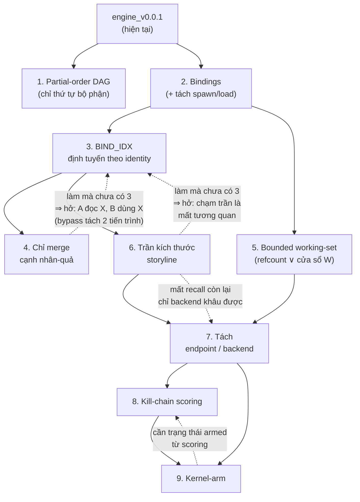

# TODO — Lộ trình `engine_v*`

Hiện trạng: [`engine_base.md`](engine_base.md) (v0, naive: full provenance graph + automaton
tuyến tính) → [`engine_v0.0.1.md`](engine_v0.0.1.md) (bỏ đồ thị, chỉ giữ storyline + automaton)
→ [`engine_v0.0.2.md`](engine_v0.0.2.md) (mục 1 dưới đây: **chỉ** partial-order DAG — không đụng
bộ nhớ/vòng đời automaton).
Mỗi mục lớn dưới đây là một bước tối ưu dự kiến (một `engine_v*` kế tiếp), kèm phân tích ưu /
nhược điểm — và với mỗi nhược điểm, chỉ rõ **bước nào khắc phục nó**. Tham chiếu `§` trỏ về
[`engine.md`](engine.md) (bản thiết kế đích).

## Sơ đồ đường tối ưu an toàn

Nguyên tắc đọc sơ đồ: đi theo mũi tên liền là **đường an toàn** — mỗi bước chỉ được làm khi các
bước nó trỏ tới đã xong. Mũi tên đứt `-.->` đánh dấu **lỗ hổng bảo mật sẽ mở ra** nếu làm bước
nguồn mà chưa có bước đích: đó là các cặp *bắt buộc đi kèm*, không được tách rời khi triển khai.

Hai ràng buộc an toàn quan trọng nhất rơi ra từ sơ đồ:

1. **Không triển khai "chỉ merge cạnh nhân-quả" (4) trước khi có bindings (2) + BIND_IDX (3).**
   Nếu làm 4 một mình, năng lực nối "actor lạ chạm object nhạy cảm" bị mất mà chưa có gì thay —
   một bước lùi so với hiện trạng, và là đường bypass rẻ (tách đọc/dùng ra hai tiến trình).
2. **Không triển khai trần storyline (6) trước khi có BIND_IDX (3).** Chạm trần → từ chối merge →
   automaton mù với event lẽ ra thuộc về nó; BIND_IDX giữ được tiến độ qua identity đã bind, phần
   recall còn lại do backend (7) khâu.
3. **Vòng đời/GC automaton không đứng riêng — thuộc cụm 2 + 3 + 5.** Bước 1 chỉ thêm partial-order,
   để automaton bất tử. Điều kiện GC phải định nghĩa trên **identity đã bind** (cần bindings (2) +
   BIND_IDX (3)) và được thực thi qua `refcount` khi đặt trần working-set (5) — làm GC sớm hơn buộc
   bịa xấp xỉ thô (process seed / deadline `seg_window`) rồi bindings thay thế ngay. Vì vậy sơ đồ
   không còn cạnh `1 → 5`: working-set nhận vòng đời automaton từ nhánh bindings (`2 → 5`).

---

# 1. Pattern = partial-order DAG (chỉ thêm thứ tự bộ phận)

> Đã có tài liệu: [`engine_v0.0.2.md`](engine_v0.0.2.md) + [`.html`](engine_v0.0.2.html). Bước này
> cố ý **chỉ làm một việc**: thêm partial-order. Vòng đời/GC automaton **không** làm ở đây — dời
> sang cụm bindings + working-set (xem cuối mục).

Thay `stage` tuyến tính bằng **bitmask tiến độ + `prereq_mask`** cho từng bước: một bước khớp được
khi mọi bit tiền đề đã bật (`prereq_mask ⊆ done_mask`), không cần đúng vị trí tuần tự. Automaton
vẫn **bất tử như v0.0.1** (seed rồi không gỡ) — không đụng vòng đời. (`engine.md §6.1`)

**Ưu điểm**
- Chấp nhận thứ tự tự do / xen kẽ hợp lệ: chuỗi tấn công thật mà hai nhóm bước tới đảo thứ tự
  (do timing hệ thống) vẫn khớp — khử cả một lớp **false negative** của automaton tuyến tính, và
  khử luôn kiểu bypass "đảo thứ tự bước để né rule".
- "Nhóm tự do thứ tự", "mốc giữa hai nhóm", "bước tùy chọn" đều rơi ra từ một phép AND/OR trên
  machine word — chi phí per-event không đổi, không phải liệt kê hoán vị trong rule.
- Thay đổi **cô lập**: chỉ ruột `ADVANCE` đổi, `ON_EVENT`/`LINE`/`Storyline`/`DISARMED` giữ nguyên
  — dễ kiểm chứng đúng đắn (automaton chỉ nặng thêm đúng một machine word `done_mask` so với `stage`).

**Nhược điểm**
- **Nhược điểm bộ nhớ của v0.0.1 còn nguyên** — bản này không đụng tới mặt bộ nhớ automaton (số
  instance seed vẫn theo tần suất khớp bước gốc, y v0.0.1; partial-order chỉ làm nhiều automaton
  *tiến xa hơn*, không tăng *số lượng*). → *Khắc phục: cụm bindings (2) + BIND_IDX (3) + bounded
  working-set (5) đưa vào cùng nhau — xem dưới.*
- Khớp lỏng theo *loại* sự kiện, chưa ràng buộc *thực thể* → tăng nguy cơ ghép nhầm các event
  không liên quan trong cùng storyline thành một chuỗi. → *Khắc phục: bước 2 (bindings).*
- Rule phức tạp hơn (viết `prereq_mask` thay vì dãy tuần tự) — chấp nhận, trả một lần lúc viết rule.

**Vì sao vòng đời/GC automaton KHÔNG nằm ở bước này.** Cho automaton một vòng đời = trả lời "automaton
còn có thể tiến không?", mà trả lời đúng cần biết **automaton phụ thuộc identity nào** — chỉ có sau
khi có `bindings` (bước 2: bind `role → identity`) + `BIND_IDX` (bước 3). GC ngay ở đây buộc phải
bịa một xấp xỉ thô (process seed, hay deadline thời gian kiểu `seg_window`) mà bindings sẽ **thay
thế** ngay — làm rồi bỏ. Hơn nữa việc **thực thi trần** (giảm `refcount` khi automaton chết, kẹp
`|working-set|`) là nội dung bước 5: refcount tăng lúc bind (bước 2), giảm lúc automaton GC — **hai
nửa của cùng một bất biến**, phải dựng cùng nhau. ⟹ điều kiện GC automaton đi cùng cụm **2 + 3 + 5**,
không tách riêng ra bước 1.

# 2. Ràng buộc identity giữa các bước (`bindings`)

Mỗi bước của pattern có thể khai báo `role → nguồn identity`; lần đầu khớp thì **bind** identity
vào role, các bước sau tham chiếu cùng role phải trùng identity — xung đột thì bước không commit
(bỏ qua an toàn, không vỡ chuỗi). (`engine.md §6.2`, `§7`)

> **Ghi chú — định nghĩa lại operation, làm cùng bước này:** để bindings đọc được đúng định danh
> file bị chạy, `exec` một-event (actor=cha, object=con, file giấu trong `attrs.image`) tách thành
> hai op nguyên tử: **`spawn`** (`actor: cha, object: process con`) và **`load`** (`actor: process
> con, object: FileId(file bị chạy)`). Map thẳng xuống sensor thật: Windows =
> `PsSetCreateProcessNotifyRoutineEx` + image-load callback; Linux = `fork()/clone()` + `execve()`
> (hook `bpf_lsm`). Nhờ `load` là cạnh nhân-quả bình thường, "A ghi Y, B không liên quan chạy Y"
> tự nối qua chính Y bằng `UNIFY_STORYLINE` sẵn có.

**Ưu điểm**
- Khử false-positive dropper: "ghi X rồi chạy **đúng X**" phân biệt được với "ghi X, chạy Y khác"
  — dù cùng storyline, cùng actor. Precision đến từ ngữ nghĩa mẫu, không từ nới ngưỡng.
- Identity ổn định (FileId/(pid,start_ts)) → miễn nhiễm rename/copy path, chống pid-reuse.
- Là nền của hai bước sau: `refcount` (bước 5) đếm theo binding; `BIND_IDX` (bước 3) tra theo
  identity đã bind — không có bindings thì cả hai không có gì để bám.

**Nhược điểm**
- Automaton phải nhớ `bound_ids` → to hơn (~vài trăm byte/instance), và binding + thứ tự tự do
  đồng thời là tổ hợp đắt nhất của matcher. → *Khắc phục: giới hạn số role mỗi pattern
  (`MAX_BIND_ARITY`) đặt ngay trong bước này; trần automaton ở bước 6.*
- Identity bị bind cần "sống" tới khi automaton chết, nếu không binding trỏ vào thực thể đã bị
  quên. → *Khắc phục: bước 5 — `refcount` ghim thực thể đang bị bind, bind giữ identity chứ không
  giữ con trỏ nên sweep không bao giờ làm gãy automaton.*
- Kênh bàn giao **không qua object có identity** (biến môi trường, IPC, command-line) thì không có
  gì để bind. → *Không bước nào khắc phục — giới hạn mô hình identity-based, cần data-flow/taint
  tracking, ngoài phạm vi cả `engine.md`; ghi nhận ở `engine.md §11`.*

# 3. Định tuyến theo identity — `BIND_IDX`

Chỉ mục nghịch đảo `key → set<(storyline, role)>`: event chạm **đúng identity đã bị một automaton
bind** được route thẳng tới automaton đó — bất kể actor của event thuộc storyline nào, bất kể op
đó causal hay chỉ là "chạm". (`engine.md §5` — "định tuyến hai kiểu")

**Ưu điểm**
- Đóng đường bypass "tách hai tiến trình": A ghi/đọc X (X bị bind), B **không liên quan nhân-quả**
  chạm X → vẫn tiến đúng automaton, không cần merge storyline nào. Đây là cơ chế duy nhất bám theo
  *một identity cụ thể* xuyên actor mà không gây bùng nổ storyline.
- Tiến automaton "phẫu thuật": không phải hợp nhất hai storyline lớn chỉ để một automaton tiến một
  bước.
- Là van an toàn bắt buộc cho bước 4 và bước 6 (xem sơ đồ) — khi merge không xảy ra (do phân loại
  causal hoặc do trần), tương quan theo identity vẫn còn.

**Nhược điểm**
- Thêm một bảng phải giữ **nhất quán tuyệt đối** với vòng đời automaton (bind → thêm entry, GC →
  gỡ entry); lệch là hoặc rò rỉ bộ nhớ hoặc automaton ma. → *Khắc phục: gỡ entry đặt trong đúng
  một chỗ — hàm GC automaton (điều kiện GC định nghĩa ở chính cụm này, cùng bindings); bước 5 ràng
  thêm bằng bất biến refcount (cùng một sự kiện nhả cả hai).*
- Chỉ thấy identity **đã bind trước đó** — không giúp gì cho tương quan giữa hai thứ chưa từng vào
  pattern nào. → *Khắc phục: đó là việc của storyline (đã có) và backend (bước 7).*

# 4. Chỉ merge trên cạnh nhân-quả

`UNIFY_STORYLINE` hiện gộp trên **mọi** loại `op`. Đổi sang: chỉ op **nhân-quả** (`spawn`, `load`,
`write`, `inject`, `create`, `dup`) mới merge storyline; op "**chạm**" (`read`, `open`, `connect`)
vẫn được tag TTP / đưa vào `ADVANCE` trên storyline của actor, nhưng **không hợp nhất** hai
storyline. (`engine.md §5`, `IS_CAUSAL`)

**Ưu điểm**
- Van chống bùng nổ *ngữ nghĩa*: mọi process đều đọc chung DLL/config hệ thống — nếu `read` cũng
  merge thì vài giây là cả máy về một storyline. Chỉ quan hệ *sản sinh/điều khiển* mới hợp nhất
  chuỗi; quan hệ *quan sát* không làm hai câu chuyện thành một.
- Storyline gọn → `ADVANCE` quét ít automaton hơn, trần ở bước 6 lâu bị chạm hơn, và ít ghép nhầm
  hành vi không liên quan vào cùng ngữ cảnh (giảm false-positive ở tầng tương quan).

**Nhược điểm**
- **Mất liên kết xuyên actor qua op "chạm"**: "A đọc X, B không liên quan dùng X" không còn đường
  nối qua storyline — bypass quá rẻ (tách đọc/dùng ra hai tiến trình) nếu triển khai bước này một
  mình. → *Khắc phục: bước 3 (`BIND_IDX`) — bám theo identity X đã bind, không cần merge; vì vậy
  bước này **bắt buộc đứng sau** bước 2+3 (cạnh đứt trên sơ đồ).*
- Tương quan "chạm" ngoài phạm vi mọi pattern (chưa ai bind X) thì endpoint chịu. → *Khắc phục
  một phần: bước 7 — backend nhận đủ mọi cạnh (kể cả touch) nên khâu lại được; phần còn lại là
  giới hạn có chủ đích của endpoint (`engine.md §11`).*

# 5. Bounded working-set

`LINE[key]` hiện là con trỏ trần `key → Storyline`, sống mãi. Nâng thành bản ghi có thêm
`refcount` (số automaton đang bind key này — tăng khi bind ở bước 2, giảm khi automaton bị **GC**)
và `last_touch`. **Bất biến**: giữ key ⟺ `refcount > 0` ∨ `last_touch ≥ now − W`; hết cả hai thì
sweep (lười, amortized) khỏi `LINE` và `Storyline.members`. (`engine.md §3`)

> **Điều kiện GC automaton chốt tại đây (cùng bước 2/3).** Bước 1 để automaton bất tử; giờ mới định
> nghĩa cái chết của nó — theo **identity đã bind** (bước 2): automaton chết khi không bit kế nào
> còn có thể commit *và* các identity nó ghim đã nguội/biến mất. Đây là chỗ "vòng đời" mà bản
> `engine.md` gán cho `seg_window` được thay bằng một điều kiện dựa trên identity thật, ăn khớp với
> `refcount` (cùng một sự kiện GC nhả cả refcount lẫn entry `BIND_IDX`).

> **Cơ chế riêng cho `DISARMED`:** không dùng refcount/cửa sổ — mỗi entry mang TTL/lease riêng,
> tự tan nếu không gia hạn, thay vì tước quyền actor vĩnh viễn. (`engine.md §9` — `ArmDirective.ttl`)

**Ưu điểm**
- Lần đầu tiên bộ nhớ **có trần thật sự**: `|LINE| ≤ Σ(bind arity của automaton sống) +
  event_rate × W` — hằng số theo cấu hình, không phụ thuộc tổng hoạt động tích lũy. RAM phẳng,
  chạy dài ngày không phình.
- Là **bất biến**, không phải chính sách eviction: thực thể đang bị bind *bất khả bỏ* → tiến độ
  phát hiện không bao giờ mất vì áp lực bộ nhớ — không có "LRU giết chuỗi lén lút".
- Sweep lười per-event → không stop-the-world, không spike độ trễ.

**Nhược điểm**
- Chuỗi có khoảng lặng dài hơn `W` giữa hai đoạn (low-and-slow): thực thể nguội-chưa-bind bị
  sweep, đoạn sau thành storyline mới — endpoint mù chuỗi này. → *Khắc phục: bước 7 — backend
  không cửa sổ khâu lại; và pattern seed sớm + bind ngay (bước 2) thì tự ghim mình vượt khoảng
  lặng. Đánh đổi có chủ đích, chỉnh bằng một núm `W`.*
- `refcount` phải cân đối tuyệt đối với vòng đời automaton — lệch là ghim vĩnh viễn (leak) hoặc
  sweep nhầm thực thể đang cần. → *Khắc phục: tăng/giảm chỉ ở hai điểm (commit binding — bước 2,
  GC automaton — điều kiện GC định nghĩa ngay tại cụm này), cùng chỗ với cập nhật `BIND_IDX`
  (bước 3) — một sự kiện, một chỗ sửa.*
- Phụ thuộc cứng bước 2 (identity để định nghĩa GC + refcount) — làm trước thì `refcount` vô nghĩa.
  Bước 1 (partial-order) độc lập, có thể làm trước hoặc song song.

# 6. Trần kích thước storyline

`MAX_NODES_PER_SID` / `MAX_AUTOMATA_PER_SID`: merge mà vượt trần thì **không merge** — hai
storyline sống riêng, không cơ chế đặc biệt nào thêm (một trần + một fallback). (`engine.md §5`)

**Ưu điểm**
- Chặn hub explosion: `explorer.exe`/`services.exe` là cha của gần cả máy — không trần thì một
  storyline nuốt tất cả, `ADVANCE` quét ngày càng đắt và mọi hành vi lành tính chung ngữ cảnh với
  mọi hành vi độc. Trần kẹp luôn chi phí per-event (`O(automata/storyline)` bị chặn trên).
- Degrade **có kiểm soát**: chạm trần → không merge → backend vẫn nhận đủ cạnh để khâu — "không
  merge tại chỗ" chứ không phải "mất âm thầm".

**Nhược điểm**
- Từ chối merge = tương quan bị cắt tại điểm trần: automaton bên này không thấy event bên kia.
  → *Khắc phục: bước 3 (`BIND_IDX`) giữ tương quan theo identity đã bind bất chấp không merge —
  vì vậy bước này đứng sau bước 3 (cạnh đứt trên sơ đồ); phần chưa bind do bước 7 (backend) khâu.*
- Kẻ tấn công có thể **cố tình bơm** storyline cho chạm trần (spawn hàng loạt con rác) rồi hành
  động sau điểm cắt. → *Khắc phục: pattern bind sớm (bước 2) thì `BIND_IDX` (bước 3) vẫn bám được
  identity đã ghim; chuỗi hoàn toàn sau điểm cắt thuộc về backend (bước 7).*

# 7. Tách endpoint / backend

Endpoint: bounded, chặn cục bộ, **ship-and-forget** mọi event (kể cả cạnh touch), không giữ đồ
thị. Backend: giữ **toàn bộ** đồ thị (thứ đã bỏ ở `engine_v0.0.1` quay lại — nhưng ở phía
backend), tương quan không cửa sổ, không trần; kết luận đi xuống dạng arm-directive.
(`engine.md §1`, `§8`)

**Ưu điểm**
- Giải đúng mâu thuẫn gốc: thứ phình vô hạn (đồ thị forensic) chỉ phục vụ điều tra → về backend;
  thứ cần cho chặn (automaton + working set) ở lại endpoint, nhẹ và bounded.
- Là **lưới đỡ recall** cho mọi đánh đổi phía trên: sweep quá `W` (bước 5), từ chối merge do trần
  (bước 6), tương quan touch ngoài pattern (bước 4), low-and-slow, xuyên host — backend nhìn thấy
  hết và khâu lại được. Điều tra viên có lại toàn bộ storyline (thứ v0.0.1 đã hy sinh).
- Endpoint đứng một mình được: mất mạng → phát hiện cục bộ y nguyên, chỉ mất phần vươn xa.

**Nhược điểm**
- Kết luận backend chịu **cửa sổ trễ** một round-trip — hành động độc lọt trong cửa sổ đó. →
  *Khắc phục một phần: bước 9 (arm sẵn trong kernel cho lần chạm kế); phần còn lại là giới hạn
  vật lý của mọi kiến trúc phân tán — hệ quả thiết kế: mẫu cần chặn hành-động-đầu-tiên PHẢI khớp
  được bằng state cục bộ.*
- Kênh điều khiển backend→endpoint là **bề mặt tấn công mới** (arm giả = DoS chặn nhầm hàng loạt).
  → *Khắc phục: trong bước này/bước 9 — ký từng directive, seq đơn điệu chống replay, TTL lease,
  trần sanity số arm (`engine.md §9`).*
- Giả định "ship được toàn bộ event" là giả định băng thông — phải đo, không mặc định đúng
  (`engine.md §11`).

# 8. Kill-chain scoring

Thay verdict `ignore/inspect/block/disarm` gắn cứng từng bước bằng **điểm tổng hợp**
`w1·(#tactic) + w2·Σseverity + w3·order_bonus + w4·Σrarity` với hai ngưỡng `θ_alert < θ_block`,
và trạng thái **`armed`** (đủ điểm nhưng bước chặn được chưa tới). (`engine.md §6.3`)

**Ưu điểm**
- Precision từ **độ phủ kill-chain**: một mình severity không đủ chặn — phải phủ nhiều tactic mới
  vượt `θ_block`; hành vi lẻ chỉ cảnh báo. Installer ghi-rồi-chạy khớp mẫu dropper nhưng đơn
  tactic → điểm thấp → không chặn nhầm.
- Thứ tự chỉ là **thưởng** (`order_bonus`), không phải điều kiện — nhất quán với bước 1.
- `armed` tách "đã đủ tin để chặn" khỏi "hành động chặn được đã tới" — tiền đề trực tiếp của
  bước 9.
- Hiệu chỉnh bằng **data** (trọng số, rarity, θ — audit-mode rồi mới bật enforce) thay vì sửa rule.

**Nhược điểm**
- Trọng số/ngưỡng sai → FP/FN hàng loạt; rarity tĩnh thì trôi theo môi trường. → *Khắc phục:
  bước 7 — backend đo tần suất TTP toàn fleet làm rarity thật + replay audit-only để hiệu chỉnh θ
  trước khi bật chặn.*
- Mất tính **giải thích được** của action-per-step (một số → khó trả lời "vì sao chặn"). → *Giảm
  nhẹ: giữ breakdown điểm theo từng thành phần trong alert; không bước nào khắc phục trọn.*
- Kẻ tấn công giữ mọi bước "dưới ngưỡng" (chỉ dùng TTP phổ biến, severity thấp). → *Khắc phục
  một phần: thành phần rarity + backend correlation (bước 7) nhìn chuỗi dài hơn; giới hạn thành
  thật của mọi hệ ngưỡng.*

# 9. Kernel-arm

Khi automaton `armed` (bước 8) mà bước chokepoint enforceable chưa tới: đẩy `(identity, op)` xuống
bảng arm trong kernel — lần chạm kế bị deny **đồng bộ ngay trong kernel**, không round-trip
userland. Disarm khi block đã nổ, automaton bị GC, hoặc hết TTL. (`engine.md §9`)

**Ưu điểm**
- Chặn tại điểm nghẽn với độ trễ kernel-path (µs): giải mâu thuẫn "tương quan cần thời gian, chặn
  phải tức thời" — tương quan xong *trước*, hành động chặn *chờ sẵn* trong kernel.
- Arm theo identity (không theo path) → rename vô hiệu, pid-reuse vô hiệu; fail-open ở userland
  nhưng chokepoint đã arm vẫn giữ được.
- Là đầu nhận của backend-arm (bước 7): kết luận backend cũng hạ xuống thành đúng loại state này.

**Nhược điểm**
- Trạng thái arm trong kernel phải **được bảo chứng liên tục** bởi storyline còn sống — arm mồ côi
  (automaton chết mà quên disarm) là chặn nhầm dai dẳng. → *Khắc phục: reconcile arm sau mỗi GC
  (bước 1/5) + TTL lease tự tan; trần `MAX_LIVE_ARMS` chặn tràn.*
- Arm giả / bị chiếm kênh = DoS chặn hàng loạt. → *Khắc phục: cơ chế ký + seq + trần sanity thiết
  kế ở bước 7 — bước này chỉ *tiêu thụ* directive đã xác thực.*
- Phụ thuộc bước 8 (trạng thái `armed`) — làm trước thì không có tín hiệu nào để arm.
