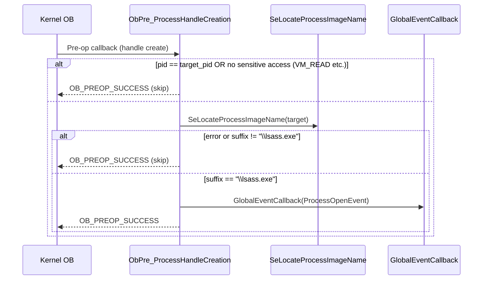

# ProcessMonitor — lsass.exe detection flows

This document describes the flow of `ObPre_ProcessHandleCreation`, the OB pre-operation callback that monitors handle creation attempts targeting `lsass.exe`.

---

## Filtering logic

1. **Self-handle**: skip if the opening process is the same as the target (`pid == target_pid`).
2. **Sensitive access**: skip if `PROCESS_VM_READ` (and other dangerous rights) are not requested.
3. **Target is lsass**: always resolve the target image path via `SeLocateProcessImageName` and check the `\lsass.exe` suffix (case-insensitive).

If all three conditions pass, a `ProcessOpenEvent` is dispatched via `GlobalEventCallback`.

---

## Sequence diagram (mermaid)

---

## Notes

- `SeLocateProcessImageName` is always called for non-trivial handle creations; the buffer is freed via `defer{ ExFreePool(image_path); }`.
- `GlobalEventCallback` is guarded against `nullptr` before being called.
- The callback does **not** modify `DesiredAccess`; it is observe-only.
