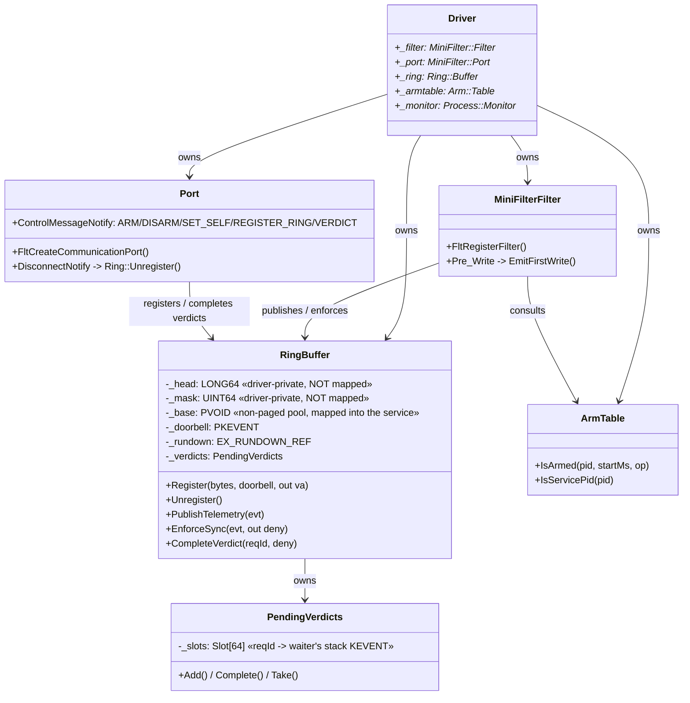
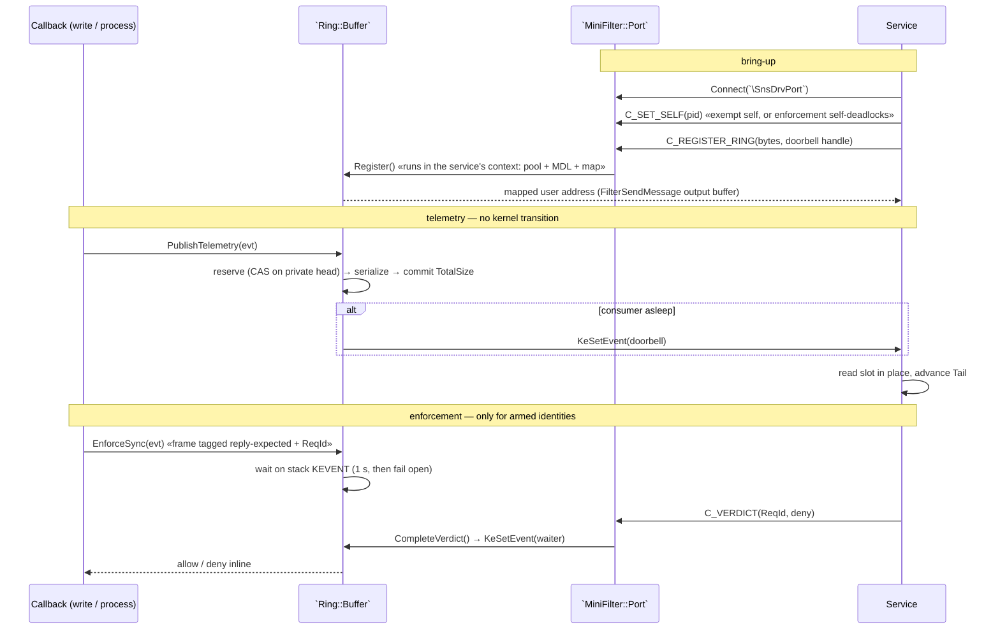

# SnsDrv — Filter Driver Utilities

This document summarizes the purpose of the `SnsDrv` component and lists coding rules and conventions followed across the source code.

## Purpose

`SnsDrv` is a kernel-mode sensor: it collects process and file events, serializes them into a shared-memory ring the user-mode service reads directly, and enforces block decisions inline for the small set of identities the engine has armed.

## Transport

Telemetry goes out through a **lock-free MPSC ring in non-paged pool that the driver maps into the service**. A callback serializes the event straight into a reserved slot and returns; there is no queue, no worker thread, no pool allocation, and — in the steady state — no kernel transition at all.

The minifilter port is still here, but it carries *only* the control plane: arm/disarm, ring registration, and verdicts. Nothing is ever sent kernel→user through it, so the driver contains no `FltSendMessage` at all.

```text
  callback ── serialize ──▶ ring slot ── reads ──▶ service ──▶ engine
                     └─ doorbell (only when the consumer is asleep) ─┘

  service ── FilterSendMessage ──▶ ControlMessageNotify   (arm / register / verdict)
```

**The service half of this contract, the byte layout, and the commit protocol are specified — and unit-tested — in `endpoint_service/src/ringbuf.rs`.** `Ring.cpp` must agree with it byte for byte; that file is the place to read before touching either side.

### Why not inverted call

Inverted call (pre-posting IRPs for the kernel to complete) is an *alternative* to a ring, not a complement: both exist to push data kernel→user. The ring wins here because a minifilter has no device object to pend IRPs on, and `KeSetEvent` is cheaper than `IoCompleteRequest`. What survives of the inverted-call idea is the shape — the consumer waits in the kernel, the producer wakes it — implemented with a shared event instead of an IRP.

### Why the control plane is not a second ring

Symmetry would be a regression. The kernel has no thread waiting on a down-ring, so one would mean re-introducing the very worker thread the ring deleted; and it would add a thread hop to the verdict path, which is the one path with a thread already blocked in the kernel waiting for an answer. The traffic does not justify it either: millions of events a second go up, a few records a second come down.

### Why the consumer must not be multi-threaded

The ring is MPSC by construction: many callbacks publish, exactly one service thread drains. More consumers would force an MPMC design (contending on `Tail`, which is what this transport exists to avoid), would destroy the ordering the enforcement path depends on, and would gain nothing anyway — they would serialize on `Pipeline::feed(&mut self)`, which propagates tags and cannot be parallelised.

### Ordering

Because enforcement requests travel the **same ring** as telemetry, the service necessarily sees every event that preceded a request before it decides. The previous design had no such guarantee: telemetry went through the worker thread while enforcement went straight from the callback, so the engine could be asked to rule on an event whose predecessors were still queued.

## Structure

- `DriverEntry` (`Entry.cpp`) initializes a `Driver` object owning:
  - `Ring::Buffer` — the shared telemetry ring plus the pending-verdict table. Holds no memory until the service asks for one.
  - `Arm::Table` — the armed `(process identity, op)` set the callbacks consult (see `EnforcementPlane.md`).
  - `MiniFilter::Filter` — registers the minifilter callbacks (`IRP_MJ_WRITE`).
  - `MiniFilter::Port` — the control port (`\SnsDrvPort`).
  - `Process::Monitor` — the process/handle callbacks.



Bring-up, then the two runtime paths:



## Ideas & Decisions Log

### Minifilter Object Management: Comparison of Approaches

| Feature | Global / Static Variable | Filter Context (FltMgr) |
| :--- | :--- | :--- |
| **Performance** | **Extremely Fast (O(1))**: Direct memory access with zero computational overhead. | **Moderate**: Involves lookup overhead and Reference Counting (Atomic Inc/Dec). |
| **Encapsulation** | **Low**: Can lead to "spaghetti code" and makes unit testing or modularity difficult. | **High**: Follows the Minifilter Framework architecture and promotes clean OOP design. |
| **Safety** | **Manual**: Developer must manually handle initialization, destruction, and synchronization. | **Automatic**: The framework manages the lifecycle (Cleanup/Delete) via registered callbacks. |
| **Scalability** | **Poor**: Difficult to manage if the driver needs to handle multiple filter instances independently. | **Excellent**: Easily maps specific objects to corresponding Filter, Instance, or Volume handles. |

**Decision:** This project utilizes a **Global Static Singleton** pattern for object management to eliminate lookup overhead and maximize I/O throughput in high-performance scenarios.

### Ring memory: driver-allocated non-paged pool

The driver allocates the region and maps it into the service, rather than the service allocating it and the driver locking its pages.

The kernel-side pointer is then just a pool address — valid at any IRQL in any context, which is what callbacks running in arbitrary process context need — with no MDL system mapping, no `MmGetSystemAddressForMdlSafe`, and no system PTEs spent. It also removes user-memory probing, and the attack surface that comes with it, from the picture entirely.

The price is real and lives in `Ring::Unregister`: `MmUnmapLockedPages` **must** run in the process the mapping belongs to, and disconnect notify offers no such guarantee — hence the referenced `PEPROCESS` and the `KeStackAttachProcess` around it. Non-paged pool is also a finite machine-wide resource, so `Register` refuses anything outside `[MIN_DATA_BYTES, MAX_DATA_BYTES]`.

### Safety invariant: what keeps this from being a kernel write primitive

The region is mapped into the service, so **the service can write anywhere in it** — including the cursors. Therefore:

- the authoritative `head` and `mask` live in `Ring::Buffer` (driver-private pool, **outside** the mapping); only a *mirror* of head is published;
- every write offset is `_head & _mask`, both operands out of the service's reach, so a write can never leave the data region;
- `Tail` is service-written and **untrusted**: it feeds only the free-space check, and an impossible `head - tail` is clamped to "full" → drop.

Worst case a compromised service corrupts its own telemetry or starves itself. It can never steer a kernel write.
